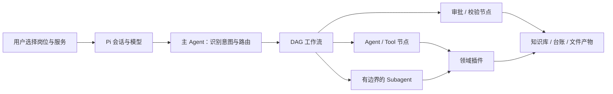

# 垂直岗位智能体工作台

一个以 [Pi](https://github.com/earendil-works/pi) 为 Agent 运行时的轻本体插件框架。当前提供两个开箱即用的岗位组合：

- `market-director`：行业研究、政府合作方案、日常文件、销售推进与复盘、周报 PPT。
- `product-director`：产品发现、PRD、指标与实验、路线图、发布评审、周报 PPT。

用户选择的是“岗位”和“服务”，不需要理解底层插件。开发者可以独立升级插件，再通过 Profile 组合成新的岗位 Agent。

> 新的 Pi Agent 不接入微信或 WeFlow。仓库中原有 WeFlow 代码只为旧版 Codex 工作台兼容保留，不会被 Pi 包及两个新 Profile 加载。

## 架构



轻本体只负责插件加载、依赖与权限校验、Profile 组合和 DAG 规划。领域规则放在插件与 Skill 中。主 Agent 负责判断“做什么”，DAG 给出“按什么顺序做”的可审计计划，Subagent 只承担边界清楚的独立研究或复核。首版的 Approval 是计划中的人工关口，还不是能阻断任意 Pi 工具调用的安全状态机。

详见 [轻本体插件架构](docs/轻本体插件架构.md) 和 [插件开发指南](docs/插件开发指南.md)。

## Pi 快速开始

要求 Pi `0.84.2` 或更高版本。建议把仓库作为实际工作 Project 使用，以便知识库、台账、模板和输出目录都位于当前工作目录：

```powershell
git clone https://github.com/WH2020/WorkFlow_Market.git
cd WorkFlow_Market
python -m agent_platform validate
python plugin\market-director-copilot\scripts\init_local_data.py --project .
pi install -l .
pi
```

Pi 扩展会按当前 Profile 动态加载 Skills；产品总监不会加载市场/销售 Skill，市场总监也不会加载产品 Skill，未进入任何 Profile 的旧版邮箱与聊天 Skill 不会加载。

进入 Pi 后：

```text
/director-profile
/director-profile product-director
/director-services
/director-run product-prd 为设备端告警功能形成 PRD
```

也可以直接用自然语言描述任务。扩展会把当前 Profile、可用服务和路由边界加入主 Agent 上下文。完整说明见 [Pi 使用说明](docs/PI使用说明.md)。

## 校验插件与工作流

平台校验器仅依赖 Python 标准库：

```powershell
python -m agent_platform validate
python -m agent_platform resolve-profile market-director
python -m agent_platform resolve-profile product-director
python -m agent_platform list-services --profile product-director
```

校验会阻止缺失或循环依赖、重复插件、DAG 环路、未知节点、节点权限越界、未约束 Subagent，以及新 Profile 中的微信/WeFlow 引用。

## 知识库

两个 Profile 都依赖 `shared.knowledge`。它把现有 `data/knowledge/source-register.csv` 作为来源登记入口，并要求所有结论标记为“已证实事实、分析判断、待验证假设、未知信息”。原始文件不被静默改写；正式业务数据仍只保存在本地，公开仓库只提交 `.example` 模板。

## 项目结构

```text
agent_platform/                   轻本体加载、校验、组合与 DAG 规划
contracts/                        插件、Profile、Workflow JSON 契约
profiles/                         市场总监与产品总监开箱组合
vertical_plugins/                 shared / market / product 插件
pi/                               Pi 扩展与产品总监/共享 Skills
plugin/market-director-copilot/   既有 Codex 兼容插件
data/                             本地知识与业务台账模板
library/templates/                演示与办公模板
docs/                             架构、开发和操作说明
```

## 当前范围

第一阶段已经形成可安装的 Pi 包、按 Profile 隔离的 Skills、可组合 Profile、插件契约、DAG 定义与确定性校验/规划骨架。尚未包含独立桌面图形界面、会强制阻断越过 Approval 的运行时状态机、逻辑工具适配器、生产级任务队列、数据库事务和分布式 Subagent 调度；因此当前定位是“可安装的规划原型”，不是无人值守的工作流执行器。

现有 Codex 市场总监插件仍可按 [旧版使用说明](docs/使用说明.md) 使用；它与新的 Pi Agent 是适配层关系，不是新架构的核心依赖。
