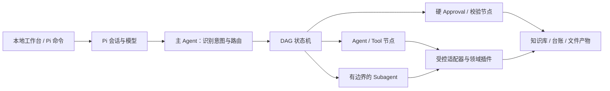

# 垂直岗位智能体工作台

一个以 [Pi](https://github.com/earendil-works/pi) 为 Agent 运行时的轻本体插件框架。当前 Windows 桌面发行版只提供一个开箱即用岗位：

- `sales-director`：客户推进、资源协调、客户与行业研究、政府合作方案、销售文件、复盘和周报 PPT。

用户直接选择销售服务，不需要再选择岗位或理解底层插件。仓库仍保留 Profile 插件框架，供开发者维护既有兼容组合，但销售总监发行版会在界面和 Pi 运行时同时锁定 `sales-director`。

> 新的 Pi Agent 不接入微信或 WeFlow。仓库中原有 WeFlow 代码只为旧版 Codex 工作台兼容保留，不会被销售总监桌面发行版加载。

## 架构



轻本体负责插件加载、依赖与权限校验、Profile 组合、DAG 状态和工具门禁。领域规则放在插件与 Skill 中。主 Agent 负责判断“做什么”，状态机约束“按什么顺序做”，Subagent 只承担边界清楚的独立研究或复核。任务快照同时写入 Pi 会话和本地 `.pi/director-runtime/`；Approval 只能由用户命令或本地工作台提出，模型不能自行批准。

详见 [轻本体插件架构](docs/轻本体插件架构.md) 和 [插件开发指南](docs/插件开发指南.md)。

## Pi 快速开始（Windows / macOS）

正式支持 Windows 10/11 与 macOS 13+ 的本机部署。基础要求为 Python 3.11+、Node.js 22.19+、Git；安装器会检查或配置 pnpm 10、Pi 0.84.2+、项目依赖、本地数据和项目级 Pi Package。建议把仓库作为实际工作 Project 使用，以便知识库、台账、模板和输出目录都位于当前工作目录。

Windows PowerShell：

```powershell
git clone https://github.com/WH2020/WorkFlow_Market.git
cd WorkFlow_Market
.\scripts\setup-windows.ps1
.\Agent4Market.exe
```

Windows 安装器使用 Tauri 2 构建根目录下的桌面程序 `Agent4Market.exe`。双击后直接打开“销售总监 AI 助手”窗口，不调用系统浏览器；程序默认以 RPC 子进程把销售总监 Pi 核心嵌入桌面应用，不再弹出 PowerShell。运行状态和最近记录可在“设置 → AI 核心”查看；只有用户主动开启“显示 AI 核心调试窗口”并重启应用时才显示独立终端。关闭桌面窗口时会回收工作台和 AI 核心进程树。EXE 不包含业务数据，也不依赖 Codex Desktop；移动 EXE 时仍必须连同整个已安装目录一起移动。

任务中心会展示结构化的“AI 处理过程”：当前阶段、已执行动作、可公开的判断依据、下一步和用户消息状态。它不是模型隐藏的逐字思维链。运行期间可以“排队补充”信息，或选择“调整当前方向”；消息先落到本地受控队列，再由 Pi 以 steering 方式在当前工具调用结束后、下一次模型调用前送达。方向调整不能绕过已完成节点、冻结载荷、权限边界或人工审批。

macOS Terminal：

```bash
git clone https://github.com/WH2020/WorkFlow_Market.git
cd WorkFlow_Market
bash scripts/setup-macos.sh
bash scripts/start-macos.sh
```

安装前后都可以运行环境体检；要求 PPT 能力同时就绪时增加 `--require-ppt`：

```text
python -m agent_platform doctor
python -m agent_platform doctor --require-ppt
```

安装器不会把密钥或本机绝对路径写入仓库或可执行配置文件。PPTX 由项目固定版本的 PptxGenJS 生成；安装器会检测并在需要时安装开源 LibreOffice，用它完成真实逐页渲染，PDF.js 与本地 Canvas 负责 PNG 预览。启动脚本只向本次 Pi 子进程注入已核验的 LibreOffice 路径和平台字体，不依赖 Codex Desktop。完整步骤见 [Windows / macOS 安装部署](docs/双平台安装部署.md)，依赖来源和许可证见 [PPT 第三方工具](docs/第三方工具.md)。

### 模型接入与选择

桌面工作台顶部提供“当前模型 / 接入或切换模型”。首版支持一个由应用托管的 NewAPI 或兼容网关：填写不带 `/v1` 的根地址和 API Key，点击“获取可用模型”，选择模型后保存并重启应用。未配置时继续使用 Pi 现有默认模型。

实现借鉴了 MIT 许可项目 [pi-provider-newapi](https://github.com/ttimasdf/pi-provider-newapi) 的动态发现、端点判断和本地目录思路，但为保证独立桌面版首次启动即可选中模型，实际由 Agent4Market 自己维护受控的 Pi 模型目录，不依赖上游扩展在会话启动后刷新。Windows 的 API Key 使用当前用户 DPAPI 加密，macOS 使用系统钥匙串；`models.json` 只保存环境变量引用。保存时应用会再次验证 `/v1/models` 并把所选模型写入 Pi 可直接读取的目录；下次启动通过 `--model agent4market-newapi/<model-id>` 绑定。公网网关必须使用 HTTPS；本机或局域网地址需要用户明确勾选允许。

每次发起任务前，可以在工作台顶栏选择“本次模型”和“思考强度”。选择会随请求冻结，Pi 在接手任务、发出第一条任务提示前实际切换模型；最终生效的模型和思考等级会写入任务记录并显示在任务卡。模型不支持所选等级时，以 Pi 实际裁剪后的等级为准。历史任务“再次创建”、中断任务“重新开始”和每日定时任务都会保留各自的显式选择；选择“默认”则在每次新任务开始时恢复应用启动时的默认模型与思考等级。

如需公开资料检索，在工作台“设置 > 公开检索”中申请、验证并保存 Brave Search API Key，然后重启应用。Windows 使用当前用户的 DPAPI 加密，macOS 写入系统钥匙串；密钥不会写入任务、日志或 Git。也可继续通过本机环境变量 `BRAVE_SEARCH_API_KEY` 提供密钥。`web.search` 只发现来源，后续 `web.open` 才读取正文；正文读取固定到已核验的公网地址，拒绝重定向、本机/私网地址、危险协议、疑似带密钥 URL 和超限响应，并限制 DNS、连接空闲和总处理时间。[Brave Search API 配置说明](https://api-dashboard.search.brave.com/documentation/guides/authentication)。

桌面发行版只加载销售总监所需 Skills，包含政府合作能力，不加载产品研发 Skills；旧版邮箱与聊天 Skill 也不会加载。

进入 Pi 后：

```text
/director-profile
/director-services
/director-run pdf-import 读取 inputs/example.pdf，提取页码证据并准备入库
/director-run presentation-studio 为管理层制作一份 6 页具身智能行业判断，受众是总经理，使用技术研究风格
/director-status
/director-approve
/director-reject approve_scope 范围需要调整
/director-cancel 暂停本次任务
```

开发诊断时也可以单独启动销售总监工作台：

```powershell
python ui/server.py
```

macOS 使用 `python3 ui/server.py`。

正常使用请直接双击 `Agent4Market.exe`。桌面窗口首页按“待确认、进行中、本周完成”组织工作，并提供销售快捷指令、项目空间、每日定时任务和自定义搜索；没有市场总监或产品总监入口。开发模式下的 HTTP 服务仍只监听本机，不会自动发送文件。完整说明见 [Pi 使用说明](docs/PI使用说明.md)。

### 项目空间、每日任务与搜索

- 项目空间把任务、资料和产物归到具体客户或机会；未归类的历史任务进入“日常工作”。上传资料只接受 PDF、Word、Excel、CSV、文本、Markdown 和 PPTX，单文件最大 32 MiB，同名文件不会被覆盖。当前自动提取能力以 PDF 为主，其他文件可作为任务引用材料。
- 每日定时任务由本地工作台调度：应用运行且到达设定时间后，才向受管 DAG 排队；当天晚些时候重新打开会补排一次，同一计划每天最多自动创建一个任务。它不会自动批准台账写入、正式 PPT 或对外发送。
- 自定义搜索默认只查本地项目、任务、知识库、销售台账、项目资料和产物。公开网络搜索不会从浏览器直接请求，而是转换为行业研究任务，经受控 `web.search` / `web.open`、来源核验和现有 Approval 执行。

## 校验插件与工作流

平台校验器仅依赖 Python 标准库：

```powershell
python -m agent_platform validate
python -m agent_platform resolve-profile market-director
python -m agent_platform resolve-profile product-director
python -m agent_platform list-services --profile product-director
```

校验会阻止缺失或循环依赖、重复插件、DAG 环路、未知节点、节点权限越界、未约束 Subagent，以及新 Profile 中的微信/WeFlow 引用。安装器同时写入受控 Subagent 配置并关闭 Pi Subagent 的通用后台任务、内置定时、Missions 和跨 Agent 通信；工作台自带的本地每日排队器不属于该机制。

## 知识库

两个 Profile 都依赖 `shared.knowledge`。受控适配器把现有 `data/knowledge/source-register.csv` 作为来源登记入口，并要求所有结论标记为“已证实事实、分析判断、待验证假设、未知信息”。网页或 PDF 读取形成的来源 URL 与精确入库 mutation 会按任务持久化到 `.pi/director-runtime/evidence/`，Agent 重启后仍不能用另一份内容冒充原证据。结构化写入会先冻结完整批次和 SHA-256 校验码，工作台展示具体内容并把审批绑定到该校验码；批准后才使用稳定 ID、记录版本、文件锁、提交日志和原子替换写入。同一 CSV 的最多 100 条变更按一个批次提交，跨销售表不伪装成一个事务。正式业务数据仍只保存在本地，公开仓库只提交 `.example` 模板。

## 项目结构

```text
agent_platform/                   轻本体加载、校验、组合与 DAG 规划
contracts/                        插件、Profile、Workflow JSON 契约
profiles/                         Profile 源码；桌面发行版锁定销售总监
vertical_plugins/                 shared / market / product 插件
pi/                               Pi 扩展、销售总监 Skills 与受控 Subagent
ui/                               销售总监桌面窗口的本地工作台内容
desktop/src-tauri/                Tauri 2 桌面壳与进程生命周期管理
plugin/market-director-copilot/   既有 Codex 兼容插件
data/                             本地知识与业务台账模板
library/templates/                演示与办公模板
docs/                             架构、开发和操作说明
```

## 当前范围

当前版本是可安装、可受管执行的双平台本地原型：已包含 Windows/macOS 安装与启动入口、NewAPI 动态模型接入与选择、统一 `doctor`、项目自带 PPT 引擎、LibreOffice 真实渲染、平台中文字体和双平台真实 PPT CI，以及销售总监 Skills、持久化 DAG 状态机、绑定具体载荷的硬 Approval、知识/销售适配器、公开搜索与受控正文读取、本地 PDF 页码提取、周报 PPT、通用 PPT 工作室和本地工作台。PPT 工作室首版覆盖周报、行业研究、政府方案和自定义演示，输出 4–10 页可编辑 PPTX，并提供经营管理、政企合作、前沿研究三套确定性视觉令牌。

行业研究会在受管 DAG 中自动调用“公开研究员”Subagent，政府合作方案会在初稿后自动调用“只读复核员”Subagent。两者均以前台独立 Pi 子进程运行：公开研究员只能使用受控网页检索和正文读取；复核员没有任何工具；二者都不能读取任意本地文件、修改知识库/销售台账、生成正式文件、审批或外发。Subagent 输出只作为主 Agent 的证据或复核意见，所有正式写入和 PPT 仍由主任务在硬 Approval 后执行。Pi Subagent 的通用后台运行、内置定时、Missions 和跨 Agent 通信默认关闭；工作台的每日任务只负责按时创建同一受管请求。

它仍不是无人值守或生产级编排平台：没有云端多租户、跨表数据库事务、自动外发、通用 Word/Excel 文件适配器或企业母版自动解析。公开研究需要用户配置 Brave Search API；任何正文、PDF 与 Subagent 输出都视为不可信资料，不能越过现有来源校验和人工审批。

本地 PDF 只从 `inputs/` 或 `data/inbox/` 读取明确文件，两处目录默认被 Git 忽略。随包安装的 PDF.js 和本地受限文本层兜底都在独立子进程中运行，限制为 45 秒和 256 MiB；不可靠兜底结果只能保持 `pending`，在线 PDF 不执行兜底。周报和 PPT 工作室都先形成可审阅的 plan/精确载荷并等待 Approval，批准后才用 PptxGenJS 构建，在 task/intent 私有目录调用 LibreOffice、PDF.js 和本地 QA 完成逐页渲染、来源备注、文本容量、边界与重叠检查，最后独占提交到 `outputs/`。缺少依赖时工作流会停在确定性工具节点，不会把结构化文本伪装成 PPT。

现有 Codex 市场总监插件仍可按 [旧版使用说明](docs/使用说明.md) 使用；它与新的 Pi Agent 是适配层关系，不是新架构的核心依赖。
