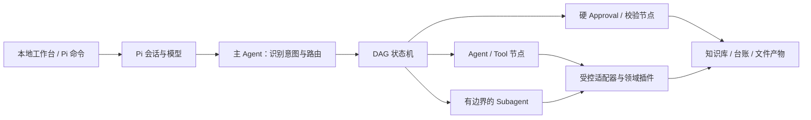

# 垂直岗位智能体工作台

一个以 [Pi](https://github.com/earendil-works/pi) 为 Agent 运行时的轻本体插件框架。当前提供两个开箱即用的岗位组合：

- `market-director`：行业研究、政府合作方案、日常文件、销售推进与复盘、周报 PPT。
- `product-director`：产品发现、PRD、指标与实验、路线图、发布评审、周报 PPT。

用户选择的是“岗位”和“服务”，不需要理解底层插件。开发者可以独立升级插件，再通过 Profile 组合成新的岗位 Agent。

> 新的 Pi Agent 不接入微信或 WeFlow。仓库中原有 WeFlow 代码只为旧版 Codex 工作台兼容保留，不会被 Pi 包及两个新 Profile 加载。

## 架构



轻本体负责插件加载、依赖与权限校验、Profile 组合、DAG 状态和工具门禁。领域规则放在插件与 Skill 中。主 Agent 负责判断“做什么”，状态机约束“按什么顺序做”，Subagent 只承担边界清楚的独立研究或复核。任务快照同时写入 Pi 会话和本地 `.pi/director-runtime/`；Approval 只能由用户命令或本地工作台提出，模型不能自行批准。

详见 [轻本体插件架构](docs/轻本体插件架构.md) 和 [插件开发指南](docs/插件开发指南.md)。

## Pi 快速开始

要求 Pi `0.84.2` 或更高版本。建议把仓库作为实际工作 Project 使用，以便知识库、台账、模板和输出目录都位于当前工作目录：

```powershell
git clone https://github.com/WH2020/WorkFlow_Market.git
cd WorkFlow_Market
python -m agent_platform validate
python plugin\market-director-copilot\scripts\init_local_data.py --project .
pi install -l .
pi
```

如需公开资料检索，在本机环境中设置 `BRAVE_SEARCH_API_KEY`；密钥不要写入仓库。未配置时研究和政府方案会停在公开检索节点并给出说明，不会回退到非官方网页抓取。[Brave Search API 配置说明](https://api-dashboard.search.brave.com/documentation/guides/authentication)。

Pi 扩展会按当前 Profile 动态加载 Skills；产品总监不会加载市场/销售 Skill，市场总监也不会加载产品 Skill，未进入任何 Profile 的旧版邮箱与聊天 Skill 不会加载。

进入 Pi 后：

```text
/director-profile
/director-profile product-director
/director-services
/director-run product-prd 为设备端告警功能形成 PRD
/director-status
/director-approve
/director-reject approve_scope 范围需要调整
/director-cancel 暂停本次任务
```

也可以启动面向非技术用户的本地工作台：

```powershell
python ui/server.py
```

浏览器打开 `http://127.0.0.1:8765`，即可选择岗位与服务、提交任务、查看 DAG，并在人工关口批准、驳回或取消。服务只监听本机，不会自动发送文件。完整说明见 [Pi 使用说明](docs/PI使用说明.md)。

## 校验插件与工作流

平台校验器仅依赖 Python 标准库：

```powershell
python -m agent_platform validate
python -m agent_platform resolve-profile market-director
python -m agent_platform resolve-profile product-director
python -m agent_platform list-services --profile product-director
```

校验会阻止缺失或循环依赖、重复插件、DAG 环路、未知节点、节点权限越界、未约束 Subagent，以及新 Profile 中的微信/WeFlow 引用。

## 知识库

两个 Profile 都依赖 `shared.knowledge`。受控适配器把现有 `data/knowledge/source-register.csv` 作为来源登记入口，并要求所有结论标记为“已证实事实、分析判断、待验证假设、未知信息”。结构化写入会先冻结完整批次和 SHA-256 校验码，工作台展示具体内容并把审批绑定到该校验码；批准后才使用稳定 ID、记录版本、文件锁、提交日志和原子替换写入。同一 CSV 的最多 100 条变更按一个批次提交，跨销售表不伪装成一个事务。正式业务数据仍只保存在本地，公开仓库只提交 `.example` 模板。

## 项目结构

```text
agent_platform/                   轻本体加载、校验、组合与 DAG 规划
contracts/                        插件、Profile、Workflow JSON 契约
profiles/                         市场总监与产品总监开箱组合
vertical_plugins/                 shared / market / product 插件
pi/                               Pi 扩展与产品总监/共享 Skills
ui/                               仅本机访问的非技术用户工作台
plugin/market-director-copilot/   既有 Codex 兼容插件
data/                             本地知识与业务台账模板
library/templates/                演示与办公模板
docs/                             架构、开发和操作说明
```

## 当前范围

当前版本是可安装、可受管执行的本地原型：已包含按 Profile 隔离的 Skills、持久化 DAG 状态机、绑定具体载荷的硬 Approval、知识/销售/公开检索适配器和本地工作台。它仍不是无人值守或生产级编排平台：没有云端多租户、跨表数据库事务、自动外发、完整办公文件执行适配器，也未内置隔离 Subagent 执行器。默认行业研究先做公开来源发现，再读取内部知识，避免把内部材料带入外部查询；仓库保留可选的有边界 Subagent Workflow，安装隔离执行器前不会被默认服务调用。

公开检索当前用于发现来源，只返回搜索服务提供的标题、URL、摘要和时间信息，不自动抓取网页正文。需要精确引用或一手材料核验时，应提供正文/PDF；否则相应细节必须保留为待验证。

现有 Codex 市场总监插件仍可按 [旧版使用说明](docs/使用说明.md) 使用；它与新的 Pi Agent 是适配层关系，不是新架构的核心依赖。
