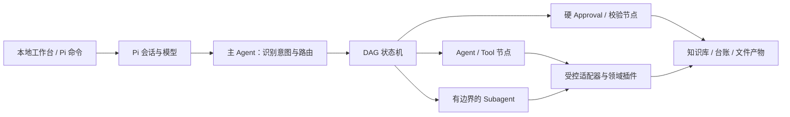

# 垂直岗位智能体工作台

一个以 [Pi](https://github.com/earendil-works/pi) 为 Agent 运行时的轻本体插件框架。当前提供两个开箱即用的岗位组合：

- `market-director`：行业研究、政府合作方案、日常文件、销售推进与复盘、周报 PPT。
- `product-director`：产品发现、PRD、指标与实验、路线图、发布评审、周报 PPT。

用户选择的是“岗位”和“服务”，不需要理解底层插件。开发者可以独立升级插件，再通过 Profile 组合成新的岗位 Agent。

> 新的 Pi Agent 不接入微信或 WeFlow。仓库中原有 WeFlow 代码只为旧版 Codex 工作台兼容保留，不会被 Pi 包及两个新 Profile 加载。

## 架构



轻本体负责插件加载、依赖与权限校验、Profile 组合、DAG 状态和工具门禁。领域规则放在插件与 Skill 中。主 Agent 负责判断“做什么”，状态机约束“按什么顺序做”，Subagent 只承担边界清楚的独立研究或复核。任务快照同时写入 Pi 会话和本地 `.pi/director-runtime/`；Approval 只能由用户命令或本地工作台提出，模型不能自行批准。

详见 [轻本体插件架构](docs/轻本体插件架构.md) 和 [插件开发指南](docs/插件开发指南.md)。

## Pi 快速开始（Windows / macOS）

正式支持 Windows 10/11 与 macOS 13+ 的本机部署。基础要求为 Python 3.11+、Node.js 22.19+、Git；安装器会检查或配置 pnpm 10、Pi 0.84.2+、项目依赖、本地数据和项目级 Pi Package。建议把仓库作为实际工作 Project 使用，以便知识库、台账、模板和输出目录都位于当前工作目录。

Windows PowerShell：

```powershell
git clone https://github.com/WH2020/WorkFlow_Market.git
cd WorkFlow_Market
.\scripts\setup-windows.ps1
.\Agent4Market.exe
```

Windows 安装器会使用系统自带的 .NET Framework 编译器生成根目录下的单文件启动器 `Agent4Market.exe`。双击后会启动仅本机可访问的工作台、打开浏览器并在同一控制台运行交互式 Pi；退出 Pi 时会自动停止本次启动的工作台。EXE 不包含业务数据，也不会复制 Codex Desktop 运行时；移动 EXE 时必须连同整个已安装目录一起移动。

macOS Terminal：

```bash
git clone https://github.com/WH2020/WorkFlow_Market.git
cd WorkFlow_Market
bash scripts/setup-macos.sh
bash scripts/start-macos.sh
```

安装前后都可以运行环境体检；要求 PPT 能力同时就绪时增加 `--require-ppt`：

```text
python -m agent_platform doctor
python -m agent_platform doctor --require-ppt
```

安装器不会把密钥或本机绝对路径写入仓库或可执行配置文件。PPTX 由项目固定版本的 PptxGenJS 生成；安装器会检测并在需要时安装开源 LibreOffice，用它完成真实逐页渲染，PDF.js 与本地 Canvas 负责 PNG 预览。启动脚本只向本次 Pi 子进程注入已核验的 LibreOffice 路径和平台字体，不依赖 Codex Desktop。完整步骤见 [Windows / macOS 安装部署](docs/双平台安装部署.md)，依赖来源和许可证见 [PPT 第三方工具](docs/第三方工具.md)。

如需公开资料检索，在本机环境中设置 `BRAVE_SEARCH_API_KEY`；密钥不要写入仓库。`web.search` 只发现来源，后续 `web.open` 才读取正文；正文读取固定到已核验的公网地址，拒绝重定向、本机/私网地址、危险协议、疑似带密钥 URL 和超限响应，并限制 DNS、连接空闲和总处理时间。[Brave Search API 配置说明](https://api-dashboard.search.brave.com/documentation/guides/authentication)。

Pi 扩展会按当前 Profile 动态加载 Skills；产品总监不会加载市场/销售 Skill，市场总监也不会加载产品 Skill，未进入任何 Profile 的旧版邮箱与聊天 Skill 不会加载。

进入 Pi 后：

```text
/director-profile
/director-profile product-director
/director-services
/director-run pdf-import 读取 inputs/example.pdf，提取页码证据并准备入库
/director-run presentation-studio 为管理层制作一份 6 页具身智能行业判断，受众是总经理，使用技术研究风格
/director-run product-prd 为设备端告警功能形成 PRD
/director-status
/director-approve
/director-reject approve_scope 范围需要调整
/director-cancel 暂停本次任务
```

也可以启动面向非技术用户的本地工作台：

```powershell
python ui/server.py
```

macOS 使用 `python3 ui/server.py`。

浏览器打开 `http://127.0.0.1:8765`，即可选择岗位与服务、提交任务、查看 DAG，并在人工关口批准、驳回或取消。选择“PPT 工作室”后会出现结构化需求表单；大纲以便利贴呈现，允许改标题和拖拽排序。修订不会直接改写已确认 plan，而是创建一个新的受管任务并重新走证据、确认和生成审批。服务只监听本机，不会自动发送文件。完整说明见 [Pi 使用说明](docs/PI使用说明.md)。

## 校验插件与工作流

平台校验器仅依赖 Python 标准库：

```powershell
python -m agent_platform validate
python -m agent_platform resolve-profile market-director
python -m agent_platform resolve-profile product-director
python -m agent_platform list-services --profile product-director
```

校验会阻止缺失或循环依赖、重复插件、DAG 环路、未知节点、节点权限越界、未约束 Subagent，以及新 Profile 中的微信/WeFlow 引用。

## 知识库

两个 Profile 都依赖 `shared.knowledge`。受控适配器把现有 `data/knowledge/source-register.csv` 作为来源登记入口，并要求所有结论标记为“已证实事实、分析判断、待验证假设、未知信息”。网页或 PDF 读取形成的来源 URL 与精确入库 mutation 会按任务持久化到 `.pi/director-runtime/evidence/`，Agent 重启后仍不能用另一份内容冒充原证据。结构化写入会先冻结完整批次和 SHA-256 校验码，工作台展示具体内容并把审批绑定到该校验码；批准后才使用稳定 ID、记录版本、文件锁、提交日志和原子替换写入。同一 CSV 的最多 100 条变更按一个批次提交，跨销售表不伪装成一个事务。正式业务数据仍只保存在本地，公开仓库只提交 `.example` 模板。

## 项目结构

```text
agent_platform/                   轻本体加载、校验、组合与 DAG 规划
contracts/                        插件、Profile、Workflow JSON 契约
profiles/                         市场总监与产品总监开箱组合
vertical_plugins/                 shared / market / product 插件
pi/                               Pi 扩展与产品总监/共享 Skills
ui/                               仅本机访问的非技术用户工作台
plugin/market-director-copilot/   既有 Codex 兼容插件
data/                             本地知识与业务台账模板
library/templates/                演示与办公模板
docs/                             架构、开发和操作说明
```

## 当前范围

当前版本是可安装、可受管执行的双平台本地原型：已包含 Windows/macOS 安装与启动入口、统一 `doctor`、项目自带 PPT 引擎、LibreOffice 真实渲染、平台中文字体和双平台真实 PPT CI，以及按 Profile 隔离的 Skills、持久化 DAG 状态机、绑定具体载荷的硬 Approval、知识/销售适配器、公开搜索与受控正文读取、本地 PDF 页码提取、周报 PPT、通用 PPT 工作室和本地工作台。PPT 工作室首版覆盖周报、行业研究、政府方案和自定义演示，输出 4–10 页可编辑 PPTX，并提供经营管理、政企合作、前沿研究三套确定性视觉令牌。它仍不是无人值守或生产级编排平台：没有云端多租户、跨表数据库事务、自动外发、通用 Word/Excel 文件适配器、企业母版自动解析，也未内置隔离 Subagent 执行器。默认行业研究按 `web.search` → `web.open` → `knowledge.search` 执行，避免把内部材料带入外部查询；仓库保留可选的有边界 Subagent Workflow，安装隔离执行器前不会被默认服务调用。

本地 PDF 只从 `inputs/` 或 `data/inbox/` 读取明确文件，两处目录默认被 Git 忽略。随包安装的 PDF.js 和本地受限文本层兜底都在独立子进程中运行，限制为 45 秒和 256 MiB；不可靠兜底结果只能保持 `pending`，在线 PDF 不执行兜底。周报和 PPT 工作室都先形成可审阅的 plan/精确载荷并等待 Approval，批准后才用 PptxGenJS 构建，在 task/intent 私有目录调用 LibreOffice、PDF.js 和本地 QA 完成逐页渲染、来源备注、文本容量、边界与重叠检查，最后独占提交到 `outputs/`。缺少依赖时工作流会停在确定性工具节点，不会把结构化文本伪装成 PPT。

现有 Codex 市场总监插件仍可按 [旧版使用说明](docs/使用说明.md) 使用；它与新的 Pi Agent 是适配层关系，不是新架构的核心依赖。
