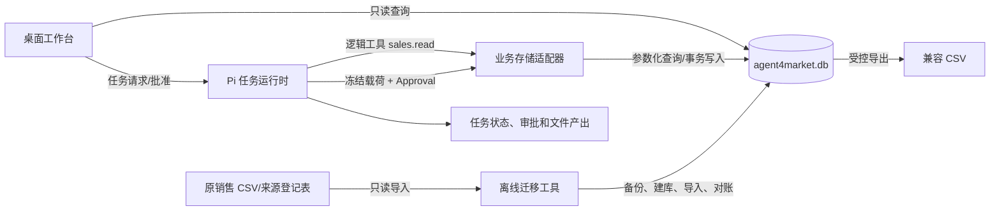
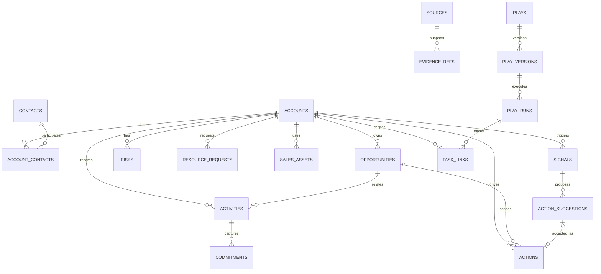
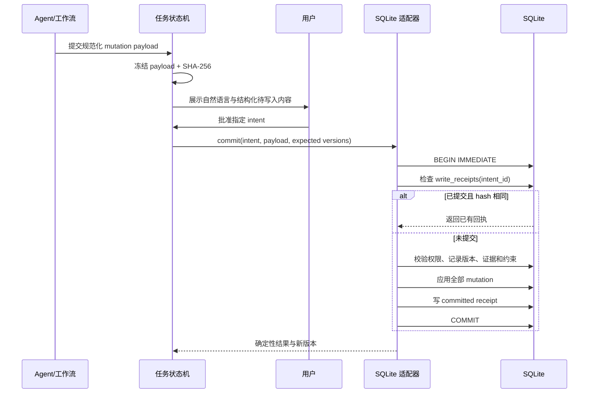
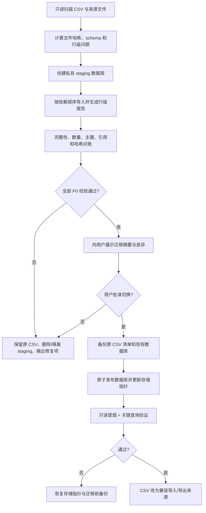

# Agent4Market 阶段 A：SQLite 数据模型与迁移设计

- 状态：schema v1 与 A1 迁移底座已实现并通过本地回归；A2 在线适配和真实数据迁移未开始
- 适用范围：销售总监本地版
- 关联需求：[客户经营核心 PRD](PRD-P0-客户经营核心.md)
- 关联计划：[实施与验收计划](PLAN-P0-实施与验收.md)
- 门禁记录：[ADR-001 SQLite 驱动门禁](ADR-001-SQLite驱动门禁.md)

## 1. 决策摘要

阶段 A 使用单个本地 SQLite 数据库承载客户经营业务数据，数据库建议路径为：

```text
<用户数据目录>/data/agent4market.db
```

设计原则：

- SQLite 是业务运行时唯一主存储；CSV 保留为导入、导出和人工检查格式，不长期双写。
- Pi 受控数据适配器是业务数据唯一在线写入者；工作台默认只读查询并通过任务/写入意图申请变更。
- 业务写入、乐观版本校验和幂等回执位于同一个数据库事务。
- 任务状态、Approval 状态、演示文稿计划、PPT 临时构建文件和用户上传原件首版继续留在现有文件系统。
- 所有 SQL 只存在于固定适配器和迁移脚本中；模型不能提交任意 SQL。
- 数据库 schema 与驱动封装跨平台，Windows 与 macOS 使用相同行为测试。

## 2. 系统边界



### 2.1 进入 SQLite 的数据

- 客户、联系人/关键人和客户关系。
- 机会、互动、承诺、风险、行动和资源申请。
- 销售资产元数据、知识来源和证据引用。
- 确定性信号、行动建议及用户反馈。
- Play 定义版本、运行关联和客户/项目/任务链接。
- CSV 迁移批次、行级结果、数据库写入回执和 schema 版本。

### 2.2 暂不进入 SQLite 的数据

- `.pi/director-runtime/tasks/` 下的 DAG 任务状态与 Approval 状态。
- 演示文稿 plan、私有构建目录、逐页 QA 和最终 PPTX/PDF。
- 用户上传的原始文档、项目空间文件和报销材料。
- 密钥、邮箱授权码、模型令牌和搜索网关令牌。

数据库只保存上述文件的受控相对路径、内容哈希、所属任务/客户和状态，不复制大文件正文。

## 3. ADR-001：SQLite 驱动选择

### 3.1 已验证事实

- 当前开发机 Node.js 为 `v24.14.0`，`node:sqlite` 可用，但仍会输出 ExperimentalWarning。
- 当前 Python 为 3.11.9，标准库 `sqlite3` 使用 SQLite 3.45.1。
- 当前 `package.json` 最低 Node 版本为 22.19.0；不能假设整个 Node 22 范围与当前 `node:sqlite` 行为完全一致。

### 3.2 选项比较

| 方案 | 优点 | 成本与风险 | 适用判断 |
|---|---|---|---|
| 固定 Node 24.19.0 + `node:sqlite` | 无第三方原生包；安装包更简单；参数化、事务和备份能力足够 | API 仍处于活跃演进；必须固定版本并持续做跨平台故障测试 | **首选，已通过 A0 技术门禁** |
| `better-sqlite3` | API 成熟、同步事务清晰 | Windows/macOS/Intel/Apple Silicon 原生二进制打包、签名和供应链成本上升 | 首选门禁失败时再评估 |
| Python 数据库代理 | 标准库稳定；单一写入进程 | 增加进程生命周期、认证协议、故障恢复和 CLI 启动复杂度 | 不作为首版默认 |
| 仅 Python 子进程逐次执行 | 依赖少 | 高频进程启动、错误恢复和事务跨调用困难 | 不采用 |

### 3.3 建议决策

阶段 A 已完成 A0 驱动门禁：候选运行时固定为 Node 24.19.0，使用 `node:sqlite` 实现 TypeScript `LocalBusinessStore`；Python 工作台仅做只读查询和离线迁移。三平台门禁与完整产品回归均通过。后续若升级 Node 或任一平台门禁失败，则停止发布并单独评审驱动，不得在运行时动态切换未验证驱动。

A0 通过标准：

- Windows x64、macOS arm64 和 macOS x64 均能建库、迁移、并发读、串行写、备份和恢复。
- 进程在事务提交前、提交后、回执写入点被强制终止时，结果都可确定。
- 锁竞争遵守有限超时，不出现无限等待。
- 同一 SQL schema 可由 Python `sqlite3` 只读打开并完成迁移对账。
- 固定运行时的 ExperimentalWarning 可被产品日志隔离，不影响用户界面；驱动行为不得依赖未测试的 Node 版本。

## 4. 数据库配置与文件布局

建议布局：

```text
<用户数据目录>/
├─ data/
│  ├─ agent4market.db
│  ├─ imports/
│  │  └─ <batch_id>/migration-report.json
│  └─ exports/<export_id>/
├─ backups/database/
│  └─ agent4market-<UTC时间>-schema-<版本>.db
└─ .pi/director-runtime/
   └─ tasks/...
```

启动连接必须设置：

```sql
PRAGMA foreign_keys = ON;
PRAGMA journal_mode = WAL;
PRAGMA synchronous = FULL;
PRAGMA busy_timeout = 5000;
```

约束：

- 不使用无限重试；`SQLITE_BUSY` 超过预算后交回任务状态机重试或让用户恢复。
- 在线业务事务保持短小，不在事务内调用模型、网络或文件转换。
- schema 迁移前必须检查剩余磁盘空间并生成可验证备份。
- 不把数据库、WAL、SHM、备份、迁移报告或业务导出提交到 Git。

## 5. 身份、时间与版本约定

- 主键：`TEXT` UUID；迁移时优先保留合法旧 ID。
- 时间：UTC ISO 8601，格式 `YYYY-MM-DDTHH:MM:SS.sssZ`；UI 按本地时区显示。
- 业务记录：`version INTEGER NOT NULL DEFAULT 1`，每次有效更新加 1。
- 删除：业务记录默认软删除，使用 `deleted_at`；Agent 不执行物理删除。
- 文本：保持用户原文；用于检索的规范化值另存，不覆盖原值。
- JSON：只存结构差异大且不作为核心关联键的值，并用 `json_valid()` 检查。
- 金额：存最小货币单位整数和 ISO 4217 币种；未知金额不得用 0 代替。
- 来源：文件路径使用受控相对路径；同时保存 SHA-256，禁止任意绝对路径穿透。

## 6. 概念模型



## 7. 核心表

### 7.1 客户、联系人和机会

#### `accounts`

| 字段 | 类型/约束 | 说明 |
|---|---|---|
| `account_id` | TEXT PK | 保留旧 `customer_id` 或 UUID |
| `name` | TEXT NOT NULL | 客户原始名称 |
| `normalized_name` | TEXT NOT NULL | 仅用于检索/重复提示 |
| `region`, `sector` | TEXT | 地区、行业 |
| `owner` | TEXT | 当前负责人，首版保留文本身份 |
| `lifecycle_stage` | TEXT | 客户层阶段；机会阶段另存 |
| `health` | TEXT | 健康度枚举或空值 |
| `budget_path` | TEXT | 已知预算路径，不得模型臆测 |
| `summary` | TEXT | 用户批准的客户摘要 |
| `project_id` | TEXT | 可选关联现有项目空间 |
| `version` | INTEGER | 乐观并发版本 |
| `created_at`, `updated_at`, `deleted_at` | TEXT | 生命周期时间 |

#### `contacts`

保存姓名、组织、职务和联系方式。迁移旧 `key_contact` / `decision_maker` 时，只创建 `identity_status='legacy_text'` 的占位联系人，不拆分或猜测姓名、职位、电话。

#### `account_contacts`

客户和联系人多对多关系，保存 `role`、`influence_level`、`decision_role`、`relationship_status`、`is_primary` 和版本。决策链是关系事实，不写回联系人本体。

#### `opportunities`

保存客户下的具体机会：名称、负责人、阶段、健康度、金额下限/上限、币种、预计决策日、赢单假设、输单原因、下一阶段进入条件和版本。金额未知时全部为空。

### 7.2 互动、承诺、风险与行动

#### `activities`

保留发生时间、渠道、互动类型、摘要、参与人、客户/机会关联、证据状态和原始来源。导入活动不自动推断情绪或商机阶段。

#### `commitments`

明确区分客户承诺和我方承诺：

- `direction`: `customer_to_us` / `us_to_customer` / `mutual` / `unknown`
- `commitment_text`
- `due_at`
- `status`: `open` / `fulfilled` / `overdue` / `cancelled` / `unknown`
- `source_activity_id`

#### `risks`

保存风险原文、分类、影响、可能性、状态、负责人、缓解行动和触发证据。旧 CSV 的 `risks` 字段首迁时作为一条原文记录，不用分号等符号自动拆分。

#### `actions`

统一保存已批准的下一步：

- 客户、机会、来源信号/任务。
- 行动内容、负责人、截止时间、优先级和状态。
- `origin`: `manual` / `accepted_suggestion` / `imported` / `workflow`。
- 完成证据和完成时间。

#### `resource_requests`

兼容现有资源申请字段，并新增机会、关联行动、审批回执和决策时间。资源决策需要保留原因，不能覆盖原申请。

### 7.3 来源与证据

#### `sources`

由现有 `source-register.csv` 演进，保留 `source_id`、标题、URL、发布者、发布日期、访问日期、地区、主题、来源类型、质量、暴露状态、状态和限制说明。文件来源增加受控相对路径和 SHA-256。

#### `evidence_refs`

把来源定位到具体实体或字段：

| 字段 | 说明 |
|---|---|
| `evidence_ref_id` | UUID |
| `entity_type`, `entity_id` | 白名单实体类型和主键；由适配器校验 |
| `field_name` | 可选，表示支撑特定字段 |
| `source_id` | 外键到 `sources` |
| `locator_json` | 页码、段落、时间戳或表格行；PDF 必须有页码 |
| `claim_kind` | `fact` / `analysis` / `hypothesis` / `unknown` |
| `verification_status` | `pending` / `verified` / `rejected` / `superseded` |
| `note`, `created_at`, `superseded_at` | 限制与生命周期 |

`entity_type/entity_id` 是受控多态关联，数据库无法使用单个外键完整表达，因此必须由白名单适配器在事务内检查目标存在；一致性扫描会报告孤立引用。

### 7.4 信号与行动建议

#### `signals`

- `signal_type`: 首版固定为 `overdue_action`、`stale_account`、`commitment_due`、`missing_critical_field`、`resource_deadline`。
- `subject_type/subject_id`: 客户、机会、行动、承诺或资源申请。
- `rule_version`、`trigger_json`、`evidence_version_hash`。
- `fingerprint`: 对规则、对象和证据版本计算 SHA-256，活动信号唯一。
- `severity`、`status`、`first_seen_at`、`last_seen_at`、`resolved_at`。

#### `action_suggestions`

保存建议文本、建议负责人/截止时间、生成模型与参数、引用信号、证据、状态和用户反馈。状态只允许：`proposed`、`accepted`、`edited_and_accepted`、`ignored`、`expired`。接受时在同一事务创建 `actions` 并写入 `accepted_action_id`。

### 7.5 Play、任务与产出关联

- `plays`：稳定 Play ID、名称、适用场景和启用状态。
- `play_versions`：版本化 brief schema、需要的逻辑工具、审批点和预期产出；定义内容保存 JSON 与 SHA-256。
- `play_runs`：运行所用版本、输入摘要、客户/项目范围、状态和开始/结束时间。
- `task_links`：把现有文件任务 ID 关联到客户、机会、Play run、项目和产出；任务正文仍由任务运行时管理。
- `artifacts`：只保存文件相对路径、类型、SHA-256、生成任务、客户/机会、创建时间和状态。

### 7.6 审计、迁移与版本

#### `write_receipts`

| 字段 | 说明 |
|---|---|
| `intent_id` | 主键，对应任务冻结写入意图 |
| `task_id`, `session_id` | 任务与批准会话 |
| `logical_tool` | 如 `sales.write` / `knowledge.write` |
| `payload_sha256` | 冻结载荷哈希 |
| `status` | `committed` 或 `reverted`；准备态在未提交事务中不对外可见 |
| `result_json` | 受影响记录、版本和摘要 |
| `committed_at` | 提交时间 |

#### `schema_migrations`

保存版本、名称、脚本 SHA-256、应用时间、应用程序版本和结果。迁移脚本只能向前执行；回滚通过恢复迁移前数据库备份完成，不依赖不完整的逆向 SQL。

#### `import_batches` / `import_rows`

批次保存来源文件哈希、schema、行数、有效/无效/跳过数、批准任务和切换状态；行表保存原行号、稳定行哈希、目标实体、结果、错误代码和原始行 JSON。原文用于对账，不参与客户查询。

## 8. 写入事务与幂等

所有业务变更继续沿用现有工作流语义：



关键规则：

- 一个 intent 的所有 mutation 必须在一个事务；阶段 A 支持客户经营相关跨表事务。
- 同一 intent + 同一 payload 重试返回相同回执；同一 intent + 不同 payload 直接拒绝。
- 更新必须提供 `expected_version`；受影响行为 0 时返回冲突，不做盲目 upsert。
- 批准后 payload、客户范围、逻辑工具或会话改变，旧批准失效。
- 事务内不得执行网络、模型、PPT 构建或任意文件读取。

## 9. 受控接口

逻辑工具名称保持兼容：

- `sales.read`：内部改为参数化查询，不再读取整张 CSV。
- `sales.write`：保持批量 insert/update 语义，增加跨核心表事务和 `expected_version`。
- `knowledge.search`：查询 `sources` 及可选全文索引。
- `knowledge.write`：事务写入来源和证据引用。

建议新增但不直接暴露 SQL 的查询：

- `account.read_360(account_id, sections, since?)`
- `account.search(query, filters, cursor, limit)`
- `signals.read(account_id?, status?, severity?, cursor)`
- `plays.recommend(goal, account_id?, expected_output?)`

前端 HTTP API 只面向本机工作台：

- `GET /api/accounts`
- `GET /api/accounts/{id}/360`
- `GET /api/accounts/{id}/timeline`
- `GET /api/signals`
- 变更仍通过任务请求和 Approval API，不新增无审批的直接业务写接口。

所有列表使用稳定排序和游标分页；禁止将自由文本拼接进 SQL。

## 10. CSV 映射

### 10.1 `customers.csv`

| 旧字段 | 新位置 | 规则 |
|---|---|---|
| `customer_id` | `accounts.account_id` | 合法且唯一则保留 |
| `customer_name` | `accounts.name` | 必填；空值整行隔离 |
| `region`, `sector`, `owner`, `stage`, `health`, `budget_path` | `accounts` 对应字段 | 原样导入，不做模型补全 |
| `key_contact` | `contacts` + `account_contacts` | 创建 legacy_text 占位关系 |
| `decision_maker` | `contacts` + `account_contacts` | 角色标为 decision_maker，不猜身份 |
| `next_action`, `next_action_due` | `actions` | 非空时创建 `origin=imported` |
| `risks` | `risks` | 作为一条原文风险，不自动拆分 |
| `last_evidence_date` | 迁移元数据/证据状态 | 不伪造 source |
| `updated_at` | `accounts.updated_at` | 非法时间隔离并报告 |

### 10.2 `activities.csv`

- `customer_id` 必须能解析到客户；否则行标记 `orphan_reference`，不自动创建空客户。
- `evidence_path` 只有在受控目录且文件存在时才生成文件来源；否则保留原值并标记待修复。
- `commitment` 创建 `commitments`，方向为 `unknown`，等待用户确认。
- `next_action` 创建 `actions`，关联来源互动。

### 10.3 `resource-requests.csv`

直接映射核心字段；客户或销售人员引用缺失时保留原行并隔离，不把未知人员归到默认用户。

### 10.4 `sales-assets.csv`

元数据进入 `sales_assets`；`source_path` 必须通过受控路径解析和 SHA-256 校验。不存在的文件不会被删除，资产状态标为 `missing_file`。

### 10.5 `source-register.csv`

进入 `sources`。现有 `key_facts`、`important_quotes` 和 `interpretation` 不直接转成客户事实；先保存为迁移备注，后续由用户批准建立 `evidence_refs`。

## 11. 迁移流程



### 11.1 迁移前

1. 停止新的业务写入并等待现有 committing intent 收敛。
2. 对所有输入文件做 SHA-256 和 schema 校验。
3. 生成只读预检报告，不修改 CSV。
4. 确认数据库目录、备份目录和磁盘空间。

### 11.2 staging 导入

依赖顺序：`sources → accounts → contacts/relationships → opportunities → activities → commitments/actions/risks → resource_requests → sales_assets → evidence_refs`。

每一行必须得到唯一结果：`imported`、`skipped_duplicate`、`quarantined` 或 `failed`。禁止静默丢弃。

### 11.3 切换

使用一个小型 `storage-backend.json` 指针文件记录：

```json
{
  "backend": "sqlite",
  "schema_version": 1,
  "database_relative_path": "data/agent4market.db",
  "migration_batch_id": "...",
  "database_sha256_at_cutover": "..."
}
```

指针只能在 staging 数据库通过校验和用户批准后原子替换。运行时不通过“数据库存在”来猜测是否已切换。

### 11.4 迁移后

- 原 CSV 保留为只读迁移快照，不覆盖、不删除。
- 新业务变更只写 SQLite；需要 CSV 时显式导出并生成导出清单和哈希。
- 连续完成两次应用重启和一次备份恢复测试后，迁移批次才标记 `completed`。

## 12. 回滚与恢复

### 12.1 切换前失败

删除或隔离 staging 数据库即可；原 CSV 和存储指针未变化，不需要业务回滚。

### 12.2 切换后冒烟失败

1. 阻止新的写任务。
2. 保存故障数据库副本和日志，不覆盖证据。
3. 原子恢复旧存储指针。
4. 若切换后尚无成功业务写入，可直接回到 CSV。
5. 若已有成功 SQLite 写入，禁止自动回到旧 CSV，以免丢失；必须先导出差异并由用户决定恢复数据库备份或人工合并。

### 12.3 数据库损坏

- 启动时执行轻量检查；备份/升级前执行 `PRAGMA integrity_check`。
- 恢复时先复制损坏文件作证据，再从最近一次验证通过的备份恢复。
- 恢复后重放只允许来自已提交回执和可验证导出的变更；不得根据模型记忆重建。

## 13. 备份与保留

- schema 迁移前强制备份。
- 建议每日首次成功业务写入后做一次增量时间点备份，至少保留最近 7 份和最近 4 个周版本；具体保留量由设置页可见但首版不开放任意目录。
- 备份成功后校验能被只读打开、schema 版本一致、关键表数量可读。
- 用户卸载应用默认保留数据和备份；删除业务数据需要独立、明确的确认流程。

## 14. 可选全文检索

FTS5 只作为加速索引，不是事实源。首版可为客户名称、互动摘要、来源标题和资产标题建立外部内容 FTS 表；任何 FTS 结果必须回查主表。若打包 SQLite 不含 FTS5，核心业务仍能使用普通参数化查询，不阻塞发布。

## 15. 数据质量与一致性检查

每次迁移和手动“检查数据库”至少报告：

- 重复客户候选和规范化名称碰撞。
- 孤立客户关系、互动、资源申请、证据和文件引用。
- 无效时间、未知枚举和版本异常。
- 标记为已核验但缺少来源的事实。
- PDF 来源缺页码、文件来源缺哈希、URL 来源缺规范化 URL。
- 同一 intent 不同 payload、同一信号 fingerprint 多条活动记录。
- 软删除父记录仍存在活动子记录的情况。

检查只报告，不自动合并客户、不删除记录、不修改用户原文。

## 16. 兼容性与发布门禁

- 安装包固定 Node 和 SQLite 运行时版本，并在“关于/诊断”页显示。
- 数据库文件保持向后只读兼容；旧应用不能打开新 schema 时必须明确拒绝，不得自动降级 schema。
- 每个应用版本声明支持的最小/最大 schema 版本。
- Windows、macOS arm64、macOS x64 必须运行同一迁移数据集和结果哈希对账。
- 未通过 A0 驱动门禁、CSV 对账、崩溃恢复或跨平台安装测试时，不允许把 SQLite 设为默认主存储。

## 17. 已知限制

- SQLite 解决本地关系数据与事务问题，不等于支持多人实时协作。
- 首版 owner/salesperson 仍可能是文本身份，尚无组织目录与权限系统。
- 受控多态 `evidence_refs` 需要应用层一致性扫描，数据库外键不能覆盖所有目标实体。
- 迁移只保留用户明确记录，不尝试从自由文本自动构造完整决策链、金额或阶段。
- A0 已确认数据库驱动方案；正式业务 schema、迁移、存储切换和客户 360 仍未实现，不能写成已上线能力。
