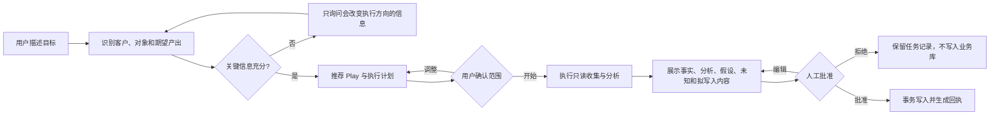

# Agent4Market 阶段 A PRD：客户经营核心

- 状态：待评审
- 目标版本：P0 / 阶段 A
- 目标用户：销售总监
- 关联分析：[销售 Agent 竞品与目标架构](agent4market-sales-agent-architecture-2026-08-21.html)
- 关联设计：[SQLite 数据模型与迁移](ARCH-P0-SQLite数据模型与迁移.md) · [实施与验收计划](PLAN-P0-实施与验收.md)

## 1. 产品结论

阶段 A 不再增加一批固定入口，而是把现有研究、政府合作、销售复盘、资源协调、文件和汇报能力，统一落到“客户—机会—证据—风险—下一步行动”这一条经营主线上。

首版必须交付四项能力：

1. SQLite 本地业务库：替代多张 CSV 作为运行时业务源，CSV 保留为导入、导出和兼容格式。
2. 客户 360：在一个页面看到客户事实、关键人、机会、互动、承诺、风险、资源和产出。
3. 信号与下一步行动：从已有记录中形成可解释的信号和行动建议，由用户确认后写入。
4. 自然语言工作入口：用户说目标，系统选择合适的 Play、补问缺失信息并生成执行计划，不要求用户先理解工作流节点。

现有硬审批、来源留痕、可恢复写入、任务可暂停/重启、政府合作和 PPT 工作室继续保留。阶段 A 不接入个人微信，不自动外发，不替销售人员替客户作承诺。

## 2. 背景与证据

### 2.1 已证实的当前状态

- 当前销售数据分别存放在客户、互动、资源申请和销售资产 CSV 中。
- 写入已具备冻结载荷、版本校验、人工批准、文件锁、回执和崩溃恢复。
- 任务运行时、项目空间、知识库、公开检索、政府合作、周报和 PPT 已可独立运行。
- 工作台已有多个快捷服务，但服务之间缺少统一客户上下文；用户往往要重复说明客户、阶段、目标和已有资料。
- CSV 适合交换和人工检查，但跨表事务、关系查询、并发更新和稳定演进成本较高。

### 2.2 基于证据的判断

- 下一阶段的主要提效点不是继续增加入口，而是让已有能力共享客户上下文和事实来源。
- 销售总监最需要的是“哪些客户值得关注、为什么、下一步由谁在何时做什么”，而不是查看 Agent 的内部节点名称。
- 数据库存储只有与客户页面、信号和行动闭环一起交付，才会形成用户价值；单独把 CSV 换成数据库不是产品成果。

### 2.3 待验证假设

- 销售总监愿意用每日 5–10 分钟确认系统识别的客户变化和下一步行动。
- 首版以手工录入、文件导入和现有任务产出为主要数据源，已能覆盖高频经营复盘。
- 一个客户可存在多个机会，但首版不需要完整替代企业 CRM。

这些假设需在 2–4 周试用中通过任务完成时间、建议采纳率和数据完整度验证。

## 3. 目标与成功指标

### 3.1 产品目标

- 降低从“发现问题”到“形成可执行下一步”的操作成本。
- 让研究、政府合作、资源方案、销售复盘和汇报自动复用同一客户上下文。
- 所有关键结论可区分事实、分析、假设和未知，并能追溯证据。
- 在 Windows 与 macOS 本地运行，不依赖 Codex Desktop。

### 3.2 成功指标

首轮试用不设未经验证的业务增长目标，先验证使用价值和工程质量：

| 指标 | 定义 | 阶段 A 验收目标 |
|---|---|---|
| 客户页面准备时间 | 从选择客户到页面可操作 | 本地 P95 ≤ 2 秒 |
| 重复输入减少率 | 同一客户连续任务中被自动带入、无需再次填写的字段占比 | ≥ 70% |
| 行动建议采纳率 | 被用户批准或编辑后批准的建议 / 展示建议 | 试用期记录基线，不强设目标 |
| 可追溯率 | 被标记为“事实”的关键字段中具有证据引用的占比 | 100% |
| 写入可恢复率 | 故障注入后可确定为已提交或未提交的写入占比 | 100% |
| 迁移对账率 | CSV 有效记录在迁移报告中可定位且数量、主键一致 | 100% |
| 主流程操作成本 | 从客户页启动复盘/方案/PPT | 不超过 3 次主动操作即可进入执行 |

## 4. 用户与核心场景

### 4.1 目标用户

唯一首发角色为销售总监。其核心责任是客户经营、销售跟进、资源协调、政府合作支持、复盘和汇报。销售人员可作为记录中的负责人或协作对象，但阶段 A 不提供独立销售人员客户端。

### 4.2 典型场景

1. 晨间关注：打开工作台，看到需要确认的客户变化、逾期承诺、无进展机会和待处理资源申请。
2. 客户复盘：选择客户后，系统汇总最近互动、关键人、机会、风险和历史产出，给出有依据的下一步建议。
3. 政府合作：从客户/区域上下文启动政府合作 Play，自动复用已知主体、地区、目标和已验证来源。
4. 资源协调：将客户阶段、决策链、截止时间和业务理由带入资源申请，批准后进入待办。
5. 临时汇报：用一句话要求“生成本周重点客户进展”，系统选择客户范围、提取已确认事实并生成大纲/PPT。
6. 信息更新：上传会议纪要或录入一条互动后，系统先展示将新增、更新和仍未知的内容，再由用户批准。

## 5. 范围与优先级

### 5.1 必须实现

- 本地 SQLite 业务库、版本迁移、备份、恢复和 CSV 兼容导入/导出。
- 客户列表、客户 360、全局客户切换器和客户上下文条。
- 客户、关键人、机会、互动、承诺、风险、资源申请、行动和证据的关联查询。
- 基于确定性规则的信号：逾期行动、长期无有效互动、承诺临期、关键字段缺失、资源申请临期。
- 下一步行动建议的“接受、编辑后接受、忽略”闭环。
- Play 选择层：自然语言目标 → 推荐 Play → 必要补问 → 可预览执行计划。
- 现有销售复盘、政府合作、行业研究、文件、PPT 和周报从客户上下文启动。
- 数据变更继续使用冻结载荷、人工批准、乐观并发和幂等回执。
- Windows 与 macOS 的迁移、备份和核心流程验证。

### 5.2 建议实现

- 客户列表保存筛选视图。
- 客户时间线按互动、任务、产出和审批筛选。
- 行动建议反馈原因，用于后续规则调优。
- 首页增加“今日关注客户”和“等待我确认”两个模块。
- 数据质量提示：重复客户、孤立互动、无来源事实、过期证据。

### 5.3 可以延期

- 邮件正文自动归档到客户时间线。
- 外部 CRM 双向同步。
- 学习型排序模型和自动销售预测。
- 多角色权限体系、团队协作和云端同步。
- 语音会议实时转写。

### 5.4 明确不做

- 个人微信接入或聊天记录抓取。
- 自动给客户、政府或内部人员发送消息或文件。
- 无人工确认的客户阶段、金额、承诺或行动写入。
- 以搜索摘要替代来源正文，或把分析/假设伪装为事实。
- 在阶段 A 完整替代 CRM、OA、财务或项目管理系统。

## 6. 信息架构

```text
销售总监工作台
├─ 今日关注
│  ├─ 待确认变化
│  ├─ 逾期/临期行动
│  └─ 高风险客户
├─ 客户经营
│  ├─ 客户列表与筛选
│  └─ 客户 360
│     ├─ 概览与下一步
│     ├─ 机会
│     ├─ 关键人与决策链
│     ├─ 互动与承诺
│     ├─ 风险与信号
│     ├─ 资源与方案
│     └─ 证据与产出
├─ 任务中心
├─ 知识库
├─ 周报/PPT
├─ 项目空间
└─ 工具与设置
```

客户上下文条固定显示在相关页面顶部，包含客户、机会、负责人、当前阶段和信息更新时间。用户可随时清空或切换上下文；系统不得悄悄沿用另一个客户。

## 7. 核心用户流程

### 7.1 从自然语言到执行



### 7.2 客户复盘

1. 用户从首页、客户列表或自然语言选择客户。
2. 系统加载客户 360，并显示数据新鲜度与缺失项。
3. 系统生成确定性信号，并按影响与时限排序。
4. Agent 基于已登记证据形成分析和建议；未知信息单独列出。
5. 用户接受、编辑或忽略建议。
6. 接受后的行动写入业务库，记录负责人、截止时间、来源任务和审批回执。

### 7.3 政府合作

1. 从客户页选择“政府合作方案”。
2. 自动带入客户、地区、合作目标、已有资料和历史方案；用户只补充本次差异。
3. 公开检索仅使用允许的公开主题，不外发内部敏感字段。
4. 正文核验后生成方案；政策事实附来源，推断明确标注。
5. 用户批准知识库/客户库写入和正式文件生成；不自动外发。

### 7.4 异常与恢复

- 数据被另一操作更新：拒绝覆盖，展示冲突字段，允许刷新后重新确认。
- 来源缺失或失效：事实降级为待核验，不生成确定语气结论。
- 数据库忙：短时重试；超过预算后保持任务可恢复，不重复提交。
- 应用崩溃：重启后通过写入意图和回执确定状态，不显示虚假的“正在进行”。
- 迁移失败：继续使用原 CSV，数据库不切换为主存储。

## 8. 功能需求

### 8.1 客户与上下文

| 编号 | 需求 | 优先级 | 验收要点 |
|---|---|---|---|
| FR-ACC-01 | 客户列表支持名称、负责人、地区、行业、阶段、健康度、更新时间筛选 | 必须 | 组合筛选结果稳定且可清空 |
| FR-ACC-02 | 客户 360 汇总所有关联记录 | 必须 | 不存在孤立的已知关联记录 |
| FR-ACC-03 | 客户上下文可由用户显式切换/清空 | 必须 | 切换任务前显示当前客户，不跨客户静默复用 |
| FR-ACC-04 | 同名或疑似重复客户只提示，不自动合并 | 必须 | 合并需单独确认且可查看差异 |
| FR-ACC-05 | 事实显示状态、来源和最后更新时间 | 必须 | 无证据事实不得显示为“已核验” |

### 8.2 机会、互动和行动

| 编号 | 需求 | 优先级 | 验收要点 |
|---|---|---|---|
| FR-SAL-01 | 一个客户可关联多个机会 | 必须 | 机会拥有独立阶段、金额区间、负责人和下一步 |
| FR-SAL-02 | 互动记录关联客户，可选关联机会、关键人和证据 | 必须 | 导入后时间线顺序正确 |
| FR-SAL-03 | 承诺与行动分开建模 | 必须 | 可区分“对方承诺”和“我方待办” |
| FR-SAL-04 | 行动具有负责人、截止时间、状态和来源任务 | 必须 | 逾期状态由系统计算，不篡改原始截止时间 |
| FR-SAL-05 | 资源申请关联客户、机会和行动 | 必须 | 决策和原因保留审计记录 |

### 8.3 信号与建议

| 编号 | 需求 | 优先级 | 验收要点 |
|---|---|---|---|
| FR-SIG-01 | 规则引擎生成可解释信号 | 必须 | 每条信号显示规则、触发记录和计算时间 |
| FR-SIG-02 | 同一规则、对象和证据版本不重复生成活动信号 | 必须 | 重跑保持幂等 |
| FR-SIG-03 | 建议区分事实依据、分析、假设和未知 | 必须 | UI 有明确标签，导出时保留 |
| FR-SIG-04 | 用户可接受、编辑后接受或忽略建议 | 必须 | 反馈与最终行动可追踪 |
| FR-SIG-05 | 生成式模型不能直接修改业务状态 | 必须 | 所有变更均形成待批准写入 |

### 8.4 Play 层

| 编号 | 需求 | 优先级 | 验收要点 |
|---|---|---|---|
| FR-PLY-01 | 根据目标、客户上下文和期望产出推荐 Play | 必须 | 推荐理由可见，用户可改选 |
| FR-PLY-02 | 补问仅针对缺失且会改变执行的字段 | 必须 | 已有客户资料不重复询问 |
| FR-PLY-03 | 执行前展示输入、数据范围、工具和预期产出 | 必须 | 涉及公开检索或写入时明确提示 |
| FR-PLY-04 | Play 采用版本化定义 | 必须 | 历史运行可定位使用的版本 |
| FR-PLY-05 | 首版预置客户复盘、政府合作、行业研究、资源协调、周报/PPT | 必须 | 均能从同一客户上下文启动 |

### 8.5 数据、审批和兼容

| 编号 | 需求 | 优先级 | 验收要点 |
|---|---|---|---|
| FR-DAT-01 | SQLite 成为业务运行时主存储 | 必须 | 切换后核心读取不再依赖 CSV 全表扫描 |
| FR-DAT-02 | CSV 支持只读迁移、按需导入和受控导出 | 必须 | 不进行无限期双写 |
| FR-DAT-03 | 写入载荷冻结并绑定任务、用户会话和版本 | 必须 | 批准后载荷变化会使批准失效 |
| FR-DAT-04 | 数据库提交与回执处于同一事务 | 必须 | 崩溃后不存在“不知是否写入” |
| FR-DAT-05 | 可从迁移前备份回滚 | 必须 | 回滚不删除用户原始 CSV |

## 9. 页面与交互要求

### 9.1 首页

- 第一屏回答三个问题：今天要看什么、为什么、下一步是什么。
- “今日关注”卡片点击后直接打开相应客户和触发证据，不再进入相同的通用表单。
- 快速输入框保留模型和思考强度选择，但 Play 推荐与客户上下文高于底层模型设置。

### 9.2 客户 360

- 顶部：客户身份、当前机会、负责人、数据新鲜度、主要风险、首要下一步。
- 中部：时间线与“信号/建议”双栏，可切换到关键人、机会、资源和证据。
- 所有写操作进入页面内抽屉或统一对话框，不使用浏览器原生 `alert/confirm/prompt`。
- 长列表刷新时保留焦点、展开状态和滚动位置；后台轮询不得抢焦点。

### 9.3 待批准内容

- 先显示自然语言摘要，再展开结构化字段。
- 每个拟写入卡片可编辑、删除和恢复；修改后重新计算载荷哈希并使旧批准失效。
- 批准按钮说明“将写入什么、影响哪个客户、是否可恢复”。

## 10. 非功能需求

### 10.1 性能与资源

- 常用客户查询 P95 ≤ 2 秒；单次本地写入 P95 ≤ 500 毫秒（不含模型和文件生成）。
- 数据库开启外键、WAL 和有限 `busy_timeout`；禁止无限重试。
- 数据库、任务日志和缓存均有明确上限、归档或清理策略。

### 10.2 安全与隐私

- 默认仅监听本机回环地址，管理接口使用会话令牌和来源校验。
- 外部检索请求只包含经过用户确认的公开查询，不包含 API 密钥、内部路径或受限客户字段。
- 数据库备份、导出和日志不得进入 Git；生产数据目录保留在 `.gitignore` 范围内。
- 邮箱仍为只读报销材料获取，不因客户经营功能扩大邮箱权限。

### 10.3 可靠性与可维护性

- 数据库 schema 版本化，每次迁移可重复验证且有备份。
- Windows 与 macOS 使用同一 SQL schema 和行为测试。
- 运行时继续通过逻辑工具权限控制访问，不允许 Agent 任意执行 SQL。
- 用户可导出标准 CSV，避免被本地数据库锁定。

### 10.4 可访问性

- 核心流程支持键盘导航和清晰焦点样式。
- 状态不能只用颜色表达。
- 弹窗具备焦点圈定、Esc 关闭策略和屏幕阅读器名称；批准类操作不得被 Esc 误提交。

## 11. 数据与证据规则

每条可影响判断的内容都需同时表达两个维度：

- 内容类型：事实、分析、假设、未知。
- 核验状态：待核验、已核验、已否定、已被取代。

“用户在销售表中记录过”可以作为一条已记录事实，但不自动等于“客户已确认”。如果没有正文、会议纪要、邮件或人工确认等证据，系统应保留核验状态和限制说明。

模型输出默认是分析或假设；只有引用已登记证据且满足对应字段规则时，才可形成待批准的事实更新。

## 12. 外部依赖、假设与风险

| 项目 | 状态 | 处理方式 |
|---|---|---|
| SQLite Node 驱动 | 待技术门禁 | 阶段 A 固定并验证运行时版本；详见架构文档 ADR |
| 现有 CSV 数据质量 | 未知 | 先做只读扫描和迁移报告，不静默修正 |
| 用户维护客户主键的习惯 | 待验证 | 保留原 ID；缺失时生成稳定导入 ID并展示 |
| 外部检索服务可用性 | 可配置 | 不可用时允许仅本地流程，明确降级 |
| 多进程并发写入 | 已知风险 | WAL、短事务、版本校验、有限重试和故障注入 |
| 数据模型膨胀 | 已知风险 | 阶段 A 只实现销售总监必要实体，不提前做完整 CRM |

## 13. 验收场景

1. 导入现有四张销售 CSV 和来源登记表，生成可审阅迁移报告；无效行被隔离且不丢失原文。
2. 打开任一客户，能看到对应互动、资源申请、资产、来源和下一步；切换客户不混入上一客户数据。
3. 新增互动触发“承诺临期”信号，用户编辑负责人后批准；重启应用后行动仅存在一份且回执可查。
4. 两个任务同时更新同一客户：先提交者成功，后提交者收到字段级冲突，不覆盖新值。
5. 从客户页启动政府合作，既有地区与客户资料自动带入；公开检索请求不包含内部备注。
6. 用户拒绝一条建议，业务库不变化，但任务与反馈记录保留。
7. 数据库迁移中途故障，应用继续使用原 CSV；确认切换前不会进入半迁移状态。
8. 数据库切换后导出 CSV，与有效迁移记录主键、数量和关键字段一致。
9. Windows 和 macOS 均能完成安装、迁移、客户查询、写入批准、备份恢复和卸载保留数据测试。

## 14. 发布门禁

阶段 A 只有同时满足以下条件才可替换当前稳定版本：

- 数据迁移、回滚、并发写入和崩溃恢复测试全部通过。
- 销售总监完成至少一轮真实数据试用并确认客户页面字段满足工作需要。
- 现有 7 个服务、政府合作、PPT、周报、任务重启与知识库回归通过。
- Windows 和 macOS 安装包使用相同 schema 版本，升级后数据可读。
- 所有 P0/P1 安全与数据一致性问题关闭；遗留风险在发布说明中可见。
