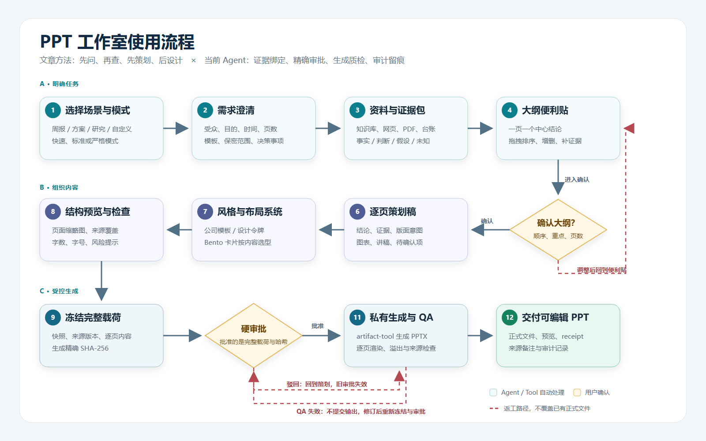
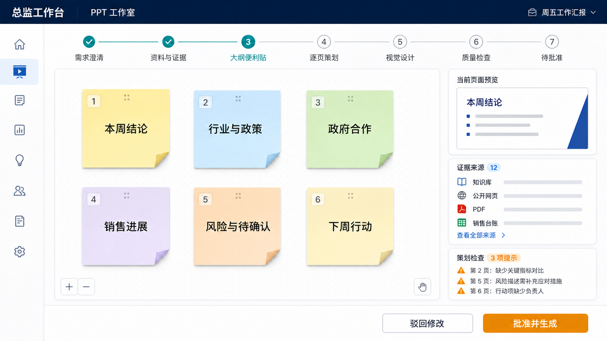

# PRD：PPT 工作室（融合到总监 Agent）

| 项目 | 内容 |
|---|---|
| 文档状态 | Phase 1 已实现，等待真实业务试运行 |
| 版本 | v1.1 |
| 日期 | 2026-08-19 |
| 首要用户 | 市场总监 |
| 次要用户 | 产品总监 |
| 目标形态 | 当前本地“总监工作台”中的共享插件与服务 |
| 参考 | [《应该是目前最强的 PPT Agent，附上完整思路分享》](https://linux.do/t/topic/1782304) |

## 1. 产品结论

建议在当前轻本体架构中新增共享插件 `shared.presentation-studio`，面向用户显示为“PPT 工作室”。现有“周五工作汇报”保留，改为 PPT 工作室的一个预设场景，不把所有 PPT 能力继续堆进 `shared.weekly-report`。

本方案借鉴参考文章的五个核心做法：先澄清需求、先检索资料、用数字便利贴组织大纲、把逐页策划与视觉设计分开、使用内容驱动的 Bento 卡片布局。现有 Agent 已经具备证据快照、来源绑定、完整载荷冻结、硬审批、真实 PPTX 生成、逐页 QA 和 receipt 恢复，因此应复用这些能力。

渲染层不照搬“整页 SVG 作为唯一输出”的路线。默认使用项目锁定版本的 PptxGenJS 生成原生可编辑的文字、形状、图表和图片；SVG 只作为复杂架构图、流程图或插图的可选页面组件；HTML 只用于快速预览，不作为正式交付文件。正式文件由 LibreOffice 真实渲染为 PDF，再由 PDF.js 逐页生成 PNG 并执行项目内 QA。这样兼顾独立部署、可编辑性、Office 兼容性、来源留痕和后续维护。

### 1.1 Phase 1 实现状态（2026-08-19）

已实现：两个 Profile 的 `presentation-studio` 服务、结构化 brief、任务级证据与 plan 哈希、大纲便利贴展示、标题编辑与拖拽排序、修订时新建受管任务、三套视觉令牌、六种布局意图、4–10 页可编辑 PPTX、两次确认/硬审批、逐页来源备注、私有生成、QA、receipt 与恢复。周五汇报的新任务已进入同一套 plan/渲染链路，旧活动任务仍由原 DAG 恢复。

Phase 1 未宣称实现：便利贴增删/复制/合并/拆分、浏览器内逐页视觉预览、完整信息密度规则、企业母版自动分析、交付后的单页修订、10 页以上演示，以及“仅本地/仅公开”资料分支。这些能力继续按下文 Phase 2 或后续迭代验收；当前工作台的大纲修订只支持标题和顺序，并强制重新建立任务与审批上下文。资料范围固定为“公开网页 + 当前 Profile 知识库”，本地 PDF 需先入库。

## 2. 背景与问题

参考文章指出，常见 AI PPT 工具容易从主题直接跳到大纲和模板，忽略“为谁讲、为什么讲、听众要做什么决定”。文章将人类 PPT 团队的工作拆为需求调研、资料搜集、大纲策划、逐页策划和视觉设计，并使用数字便利贴与 Bento Grid 降低结构调整和版式生成难度。

以下是本次改造前的能力基线：

- 已有市场总监、产品总监两个 Profile，能够调用知识库、公开网页、PDF、销售台账和任务审计。
- 已有周报专用 DAG：`weekly.snapshot → build payload → validate/freeze → Approval → artifact.deck.write`。
- 已能生成 4–10 页可编辑 PPTX，逐页渲染、检查溢出与 speaker notes 来源，并在 QA 通过后独占提交到 `outputs/`。
- 当前只支持 `ceo-weekly` 模板和周报载荷；没有通用 PPT 项目、澄清问答、大纲便利贴、逐页策划编辑、模板分析或页面级修订界面。

因此，本需求不是重写 PPT 生成器，而是在安全生成链路之前补齐“PPT 规划产品”，并把周报能力抽象为可复用服务。

## 3. 用户与核心场景

### 3.1 首要用户：市场总监

典型任务：

- 每周管理汇报：行业、政府合作、销售推进、风险和下周动作。
- 行业专题汇报：脑机接口、具身智能、数据采集等方向的趋势和判断。
- 政府合作方案汇报：面向地方政府的合作背景、价值、方案、资源和里程碑。
- 客户或销售复盘：客户现状、关键证据、阻塞、资源申请和下一步动作。
- 临时管理汇报：把已有研究、PDF 或内部材料整理为可讲述的演示文稿。

### 3.2 次要用户：产品总监

复用相同工作室，但内容预设不同：产品机会、PRD 评审、路线图、版本发布、指标实验和产品周报。产品总监 Profile 不得读取市场销售台账。

### 3.3 主要痛点

- 用户往往只知道“要做一份 PPT”，不能一次说清受众、目标、页数和关键决策。
- 研究事实、内部判断和待验证信息容易混写。
- 大纲一旦直接进入设计，后续调序或删页成本高。
- AI 容易为填满页面而增加无来源内容，或生成字太小、信息过密的页面。
- 生成后的局部修改容易牵连整套 PPT，审批内容也可能与最终文件不一致。

## 4. 产品目标与成功指标

以下数值是 MVP 验证目标，不是当前已实现数据；首批至少用 10 个真实任务验证。

| 目标 | MVP 指标 |
|---|---|
| 内容可用 | 首稿中至少 70% 页面无需结构性重写 |
| 来源可信 | 含外部事实的页面 100% 有可追溯来源；无证据内容必须标为判断、假设或未知 |
| 审批一致 | 100% 正式输出绑定当前 Profile、上下文快照、完整载荷和 SHA-256 |
| 版面质量 | 正式交付 0 溢出、0 缺页、0 缺失来源备注；默认正文字号不小于 18 pt |
| 操作效率 | 标准 7–10 页汇报在不计用户等待和外部网络异常时，自动处理时间目标不超过 15 分钟 |
| 稳定性 | 有效输入下生成并通过 QA 的任务比例达到 90% 以上 |

## 5. 范围与优先级

### 5.1 必须实现（MVP）

1. 新建 PPT 项目，选择场景、Profile 和处理模式。
2. 收集受众、目标、使用场合、演讲时间、页数、模板、资料范围、保密等级和期望决策。
3. 信息不足时生成 3–7 个关键澄清问题；已知信息不得重复询问。
4. 从当前 Profile 授权的数据源构建证据包，并区分事实、判断、假设、未知。
5. 生成可增删、拖拽排序、编辑和补充来源的“大纲便利贴”。
6. 为每页生成逐页策划稿：中心结论、目标受众动作、证据、内容层级、版面意图、图表/图片建议、讲者备注和待确认项。
7. 提供内置设计令牌和 Bento 布局选择，不以固定模板强套所有页面。
8. 展示结构预览、来源覆盖、字数/字号风险和待确认项。
9. 冻结完整载荷并展示 SHA-256；只有用户硬审批后才能生成正式 PPTX。
10. 私有目录生成、逐页渲染和 QA；失败时不提交正式文件。
11. 输出可编辑 PPTX、逐页预览、来源备注、文件哈希、receipt 和任务审计记录。
12. 现有“周五工作汇报”通过预设参数进入同一套 PPT 工作室链路。

### 5.2 建议实现（第二阶段）

- 上传并分析公司 PPT 模板的母版、字体、颜色、Logo 安全区和常用版式。
- 在生成后按“单页”提出修改，旧版本保留，不直接覆盖。
- 为复杂流程图、架构图提供 SVG 组件生成，并在 PPT 中保持可编辑或可替换。
- 支持 4–20 页演示；MVP 延续当前 4–10 页限制。
- 增加版本对比：哪些页面、来源和结论发生变化。

### 5.3 可以延期

- 多人在线协作、评论和云同步。
- 动画、转场、视频和复杂媒体编排。
- Word、Excel 任意格式直接导入；MVP 仍以知识库、网页、PDF、销售 CSV 和任务快照为主。
- 自动生成演讲视频或旁白。

### 5.4 明确不做

- 不自动外发 PPT、提交政府审批或发送给客户。
- 不读取个人微信聊天。
- 不绕过登录、反爬或访问控制读取资料。
- 不允许模型自行批准，也不允许普通文件写入绕过 `artifact.deck.write`。
- 不为填满页数编造数据、客户进展或政策结论。

## 6. 使用模式

| 模式 | 适用场景 | 用户确认点 |
|---|---|---|
| 快速 | 结构稳定的周报、内部例会 | 缺关键条件才提问；正式生成前一次硬审批 |
| 标准（默认） | 行业研究、销售复盘、普通方案 | 需求澄清、大纲确认、正式生成硬审批 |
| 严格 | 政府方案、管理层决策、重要客户 | Phase 1 为需求澄清、大纲确认、正式生成硬审批；独立逐页策划确认留到 Phase 2 |

Phase 1 的工作流关口是“大纲确认”和“正式生成硬审批”；后者同时展示逐页策划并绑定完整载荷、意图 ID、任务版本和 SHA-256。独立的“逐页策划确认”属于 Phase 2。任何内容或来源变化都会使旧审批失效。

## 7. 使用流程图



[查看可编辑 SVG 原图](assets/ppt-studio-usage-flow.svg)

关键规则：

- 研究顺序仍为外部来源发现与正文读取优先，再读取内部知识，防止内部资料进入外部搜索请求。
- 便利贴阶段只组织叙事结构，不提前追求视觉效果。
- 逐页策划稿固定“讲什么”，视觉设计负责“怎么呈现”。
- 结构预览可以使用 HTML/SVG 或卡片缩略图，但正式 PPTX 仍在硬审批后生成。
- QA 失败不会向 `outputs/` 提交文件；修订后必须重新冻结和审批。

## 8. 界面设计

### 8.1 概念界面



> 概念图用于确认信息架构和交互方向，不是最终视觉规范。图中显示的是“大纲便利贴”阶段；右侧预览是结构预览，不代表已经生成正式 PPTX。

### 8.2 信息架构

1. **左侧导航**：工作台首页、PPT 工作室、研究、销售、知识库、产物和设置。
2. **顶部项目栏**：当前 Profile、PPT 场景、模式、保存状态和任务状态。
3. **阶段导航**：需求澄清、资料与证据、大纲便利贴、逐页策划、视觉设计、质量检查、待批准。
4. **中央画布**：数字便利贴或逐页策划卡；支持拖拽、增删、复制、合并、拆分和标记待确认。
5. **右侧检查栏**：当前页结构预览、证据来源、来源覆盖、字数/字号风险和待确认问题。
6. **底部操作栏**：保存草稿、驳回修改、确认当前阶段；在硬审批阶段显示完整载荷摘要和“批准并生成”。

### 8.3 关键交互

- 点击便利贴，在右侧编辑中心结论、页面目标、证据和备注。
- 拖拽便利贴改变页序；页码和目录自动更新。
- 无来源的外部事实显示红色告警，不允许进入“可审批”状态。
- 仅有内部判断但无外部证据时允许保留，但必须选择“分析判断”标签。
- 用户删除页面时同时提示该页引用的证据是否仍被其他页面使用。
- 模板和配色通过有限选项呈现，避免要求非设计用户编写提示词。
- 生成期间显示当前步骤和预计剩余阶段；不伪造精确完成时间。

### 8.4 必须覆盖的界面状态

- 空状态：尚未创建 PPT 项目或尚无证据。
- 加载状态：正在检索、读取 PDF、生成策划或渲染预览。
- 部分失败：某个来源无法读取，但其余证据可继续；明确列出缺失项。
- 阻断失败：无可用证据、审批过期、模板损坏、生成器或 QA 失败。
- 冲突状态：任务版本、载荷哈希或本地文件在审批后发生变化。
- 恢复状态：重启后从任务、证据、意图和 receipt 恢复。

## 9. 功能需求

### PPT-001 新建项目

用户选择 Profile、场景和模式，填写主题。系统自动带入对应预设，但不得把另一个 Profile 的数据或页面结构带入。

**验收**：市场总监可以看到周报、行业研究、政府合作、销售复盘和自定义；产品总监看到产品类场景，且不能读取销售台账。

### PPT-002 需求澄清

系统形成 `PresentationBrief`，字段包括受众、目的、使用场合、时长、页数、语言、模板、资料范围、保密等级、期望决策和截止时间。

**验收**：缺少受众、目标或输出用途时必须暂停并提问；用户已明确的字段不重复询问。

### PPT-003 资料与证据包

调用已授权的 `web.search`、`web.open`、`pdf.read`、`knowledge.search`、`sales.read` 或 Profile 快照工具，建立稳定来源 ID、访问时间、内容哈希、页码/段落和可靠性状态。

**验收**：页面事实必须引用当前任务证据 registry；未登记来源不能进入正式载荷。

### PPT-004 大纲便利贴

按金字塔原则生成封面、章节和页面卡片。每张卡只表达一个中心结论，并显示来源数量、信息状态和风险提示。

**验收**：用户可以增删、拖拽、复制、合并和拆分页卡；任何变化都会更新项目版本。

### PPT-005 逐页策划稿

每页生成 `SlidePlan`：结论式标题、受众应获得的认识或动作、事实与来源、分析判断、版面类型、图表/图片需求、讲者备注和待确认项。

**验收**：策划稿不得把设计占位文本当作正式事实；外部事实的来源覆盖率必须达到 100%。

### PPT-006 风格与布局系统

MVP 提供不少于三套设计令牌：管理汇报、政府方案、科技研究。布局根据内容类型从单一焦点、50/50、2/3+1/3、三栏、顶部英雄和混合网格中选择。

**验收**：最重要内容必须获得最大视觉层级；默认卡片间距一致；不得因为套模板而截断内容。

### PPT-007 结构预览与策划检查

在正式 PPT 生成前展示页面缩略图和检查结果：页数、字数、信息密度、来源覆盖、重复标题、缺少对比口径、缺责任人/时间和待确认项。

**验收**：阻断级问题未解决时不能进入硬审批；提示级问题可由用户明确接受。

### PPT-008 冻结与审批

冻结 Profile、brief、context snapshot、outline、SlidePlan、design tokens、sources、output name 和版本，生成规范化载荷与 SHA-256。

**验收**：批准必须匹配任务版本、intent ID 和载荷哈希；内容变化后旧审批不可复用。

### PPT-009 私有生成与 QA

在 task/intent 私有目录使用 PptxGenJS 生成 PPTX，并由 LibreOffice、PDF.js 和项目内 QA 完成逐页渲染、布局、来源备注、页数、文件类型、边界、重叠和文本容量检查。

**验收**：只有 QA 全部通过才可独占提交到 `outputs/`；不得覆盖已有同名文件。

### PPT-010 修订与版本

MVP 支持在正式生成前按页面修改；第二阶段支持对已生成版本进行单页修订，生成新版本而非覆盖旧文件。

**验收**：版本记录能够显示修改页面、变化字段、来源变更和新旧文件哈希。

### PPT-011 交付

交付内容包括 PPTX、逐页预览、来源备注、载荷哈希、文件哈希、receipt、资料时间范围、待确认项和未执行的外部操作。

**验收**：相同 intent 重试能恢复已有提交；文件或 receipt 不一致时停止并要求人工核对。

## 10. 核心数据契约

```text
DeckProject
  project_id, task_id, profile_id, scene, mode, status, version
  brief
  context_snapshot_id, context_snapshot_sha256
  outline[]
  slides[]
  design_system
  output_name
  payload_sha256, intent_id
  artifacts[], created_at, updated_at

SlidePlan
  slide_id, order, slide_type
  conclusion_title
  audience_takeaway
  facts[], analyses[], hypotheses[], unknowns[]
  evidence_refs[]
  layout_intent, visual_assets[]
  speaker_notes, warnings[]

EvidenceRef
  source_id, title, source_type
  url 或 project_relative_path
  page_or_section
  content_sha256, reliability, accessed_at
```

项目对象只保存来源引用和必要摘要，不把 API 密钥、登录态或敏感查询参数写入载荷、备注、截图或 Git。

## 11. 工作流与架构融合

### 11.1 插件划分

- 新增 `shared.presentation-studio`：brief、证据包、大纲、策划、设计令牌、预览、冻结和通用 PPT 工作流。
- 保留 `shared.weekly-report`：负责生成周报专用上下文，随后调用 PPT 工作室预设。
- 复用 `shared.knowledge`、`shared.research` 和 `shared.documents`。
- 市场与产品 Profile 都加载 PPT 工作室，但通过 Profile 权限和场景预设隔离数据。

### 11.2 建议 DAG

```text
create_brief
→ clarify_requirements（必要时循环）
→ collect_context
→ propose_outline
→ confirm_outline（标准/严格模式）
→ build_storyboard
→ confirm_storyboard（严格模式）
→ select_design_system
→ validate_plan
→ freeze_payload
→ hard_approval
→ render_private_deck
→ qa_deck
→ commit_artifact
```

MVP 继续由主 Agent 负责对话与任务路由，DAG 负责顺序和权限，工具负责确定性读取、冻结、生成和提交。当前已为行业研究接入受控公开研究员，为政府合作草案接入无工具只读复核员；PPT 工作室本身仍由主 Agent 形成 plan、冻结载荷并在人工 Approval 后生成，避免把正式演示写入交给 Subagent。

### 11.3 渲染策略

| 方案 | 定位 | 决策 |
|---|---|---|
| PptxGenJS 原生 PPT 元素 | 正式 PPTX | 默认方案，使用公开依赖并延续 Approval、QA 与 receipt 链路 |
| SVG | 复杂流程图、架构图、信息图组件 | 可选；不默认把整页扁平化 |
| HTML/CSS | 结构预览、版式试算 | 仅预览，不冒充正式 PPT |
| 位图整页 | 极少数不可编辑视觉页 | 非默认，必须明确标记不可编辑区域 |

## 12. 状态机与不变量

建议状态：

```text
draft → clarifying → collecting_evidence → outline_review
→ planning → plan_review → ready_for_approval → waiting_approval
→ rendering → qa → completed

任意可编辑阶段 → cancelled
确认被驳回 → revision_requested
生成或 QA 异常 → failed / recoverable
```

不变量：

- 模型不能自行推进用户确认或硬审批节点。
- 正式输出只能来自当前已批准载荷。
- Profile、周期、来源和模板版本必须与冻结快照一致。
- QA 失败、审批失效或输出名冲突时不覆盖正式文件。
- 对已交付 PPT 的修订必须生成新版本和新 receipt。

## 13. 非功能需求

### 安全与隐私

- 默认仅本机访问，正式业务数据、任务状态、PPT 和预览不提交 Git。
- 不自动发送、上传或分享文件。
- 外部网页、PDF 和模板均视为不可信输入，不执行其中指令。
- 带密钥、token、签名或账号信息的 URL 不得进入载荷和 speaker notes。

### 可用性

- 非技术用户不需要看到工具名、JSON 或命令；高级详情可折叠查看。
- 所有高风险操作给出对象、影响、版本和恢复方式。
- 支持键盘选择、排序替代操作、清晰焦点和足够颜色对比。

### 视觉与演示质量

- 默认 16:9；默认正文不小于 18 pt，说明文字原则上不小于 14 pt。
- 每页一个中心结论，避免纯装饰页面和无意义图标。
- 数据图表必须显示口径、时间范围和来源。
- 所有页面都要经过渲染检查，不以“文件成功写出”代替视觉验收。

### 性能与恢复

- 每个外部来源和生成步骤设置超时、大小与并发上限。
- 用户刷新或 Agent 重启后可从任务、证据、载荷和 receipt 恢复。
- 同一 intent 只允许一个生成提交者；重复请求要么恢复，要么明确失败。

## 14. 验收测试

1. 只输入“做一份具身智能 PPT”时，系统先询问受众、目的和使用场合，不直接生成。
2. 用户明确受众、目的和页数后，不重复询问相同问题。
3. 公开搜索不可用时，界面明确显示缺失来源，不把模型常识伪装成检索结果。
4. 本地 PDF 页面引用在策划稿、speaker notes 和最终 receipt 中保持一致。
5. 拖拽、增删或编辑便利贴后，项目版本和最终载荷哈希发生变化。
6. 无来源的外部事实不能进入可审批状态；分析判断可以保留但必须有类型标签。
7. 使用市场总监 Profile 生成销售复盘时可读取授权销售表；产品总监执行相同请求时被拒绝。
8. 用户批准后载荷、来源或模板文件发生变化，生成必须停止并要求重新审批。
9. 私有生成失败、缺页、溢出、备注缺失或 QA 失败时，`outputs/` 不出现正式 PPTX。
10. 已有同名文件时不覆盖；界面提示更换输出名。
11. 同一 intent 并发触发时只有一个提交者，receipt 不丢失。
12. 相同 intent 在提交后重试能按文件哈希和 receipt 幂等恢复。
13. 每页预览、PPTX 页数和 speaker notes 页数一致。
14. 完成状态展示正式文件、预览、来源、哈希、receipt 和未执行的外部动作。

## 15. 分期建议

### Phase 1：规划工作室 MVP

- 新增 `shared.presentation-studio` 和服务入口。
- 实现需求 brief、澄清问题、证据包、大纲便利贴、逐页策划、三套设计令牌和标准/严格模式。
- 泛化现有周报载荷，但仍限制 4–10 页。
- 复用当前 Approval、QA、receipt 与恢复链路，生成与渲染改为公开可安装工具链。
- 先由销售总监完成真实试运行；本桌面发行版不开放其他总监角色。

### Phase 2：模板与页面修订

- 公司模板分析与版本化。
- 单页修订、版本对比和可选 SVG 组件。
- 支持更长演示和更多图表类型。

### Phase 3：受控并行与协作

- 在现有只读 Subagent 基础上评估多来源并行检索和视觉复核；正式写入、审批与外发仍不下放。
- 评估多人评论、云同步或审批系统连接；默认仍不自动外发。

## 16. 主要风险与待确认决策

| 风险或问题 | 当前建议 |
|---|---|
| 确认点太多，影响效率 | 默认标准模式；周报使用快速模式；重要政府/客户汇报使用严格模式 |
| 整页 SVG 可编辑性与兼容性不稳定 | 原生 PPT 元素优先，SVG 只做复杂视觉组件 |
| 公司模板差异大 | MVP 使用内置设计令牌，模板分析放入 Phase 2 |
| AI 为满足页数补造内容 | 缺内容时删页或标为未知，不强行满足目标页数 |
| 页面级修改导致审批失配 | 修改后重新冻结；正式文件生成新版本，不覆盖旧版本 |
| 字号过小、信息过密 | 默认正文字号和信息密度门槛进入阻断/提示规则 |
| 图片版权与来源 | 外部图片必须保留来源与许可状态；无法确认时不进入正式文件 |

需要产品负责人确认的三项决策：

1. MVP 是否接受继续限制为 4–10 页，以换取较小改造范围。
2. 公司模板分析是否必须进入 MVP；本 PRD 建议放到 Phase 2。
3. 市场总监首轮试运行选择哪三类真实材料；建议为周报、行业专题和政府合作方案。

## 17. 参考方法与需求映射

| 参考文章思路 | 本 PRD 落点 |
|---|---|
| 从提问开始，不直接一键生成 | PPT-002 需求澄清 |
| 大量检索并使用真实资料 | PPT-003 证据包与来源 registry |
| 数字便利贴组织大纲 | PPT-004 大纲便利贴 |
| 策划稿与设计稿分离 | PPT-005、PPT-006 |
| Bento Grid 内容驱动布局 | PPT-006 风格与布局系统 |
| SVG 保持清晰和编辑能力 | 复杂视觉组件可选 SVG；正式 PPT 仍优先原生元素 |
| 重要 PPT 可在策划阶段精调 | 标准/严格模式的阶段确认 |
