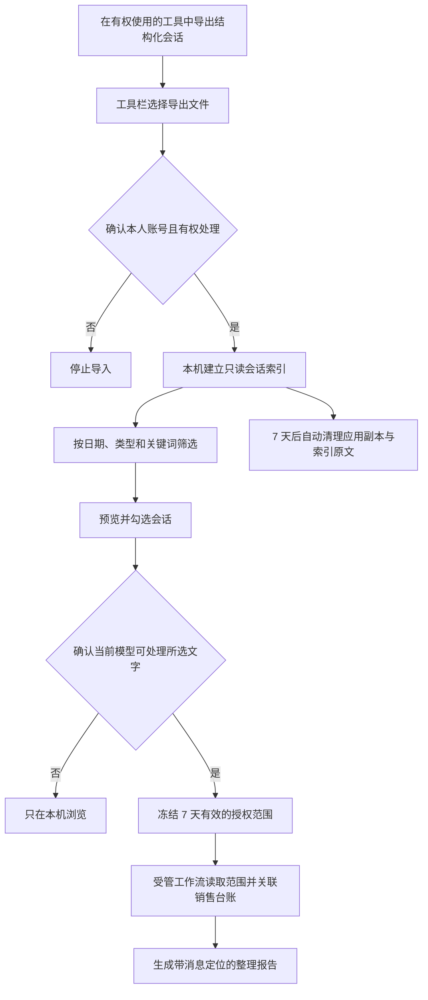

# 微信会话导入与整理

## 功能定位

销售总监版可把本人有权处理的微信会话导入本机，按联系人、群聊、日期和关键词筛选，再交给当前选择的模型整理销售进展、承诺、异议、风险与下一步。

这不是后台监控或微信插件。当前版本：

- 不连接微信进程，不读取进程内存，不提取数据库密钥。
- 不扫描微信安装目录或任意本地目录。
- 不修改微信数据库，不发送消息，不自动更新销售台账。
- 不接入 WeFlow。
- 只接受用户在“工具栏 → 微信会话整理”中主动选择的 JSON、JSONL 或 CSV 文件。

设计参考 [WXDecipher](https://github.com/JiaoTangXQ/WXDecipher) 的只读原库、工具自有副本、统一消息模型、来源定位和定期清理思路。其当前公开仓库明确处于设计规范阶段，目标平台为 macOS 与微信 4.x，并没有可直接集成的完整业务代码；因此 Agent4Market 不宣称能够自动解密微信数据库，也没有复制其实现代码。

## 使用流程



### 1. 准备结构化导出

文件扩展名必须为 `.json`、`.jsonl` 或 `.csv`，单个文件不超过 64 兆字节。每条消息至少要能识别以下信息：

| 信息 | 推荐字段 | 可识别别名示例 |
|---|---|---|
| 会话标识 | `conversation` | `conversation_id`、`talker`、`username`、`chat_id`、`room_id` |
| 会话名称 | `conversation_name` | `display_name`、`talker_name`、`chat_name`、`room_name` |
| 消息标识 | `message_id` | `msg_id`、`local_id`、`id` |
| 发送者 | `sender_name` | `sender`、`from_name`、`author` |
| 是否本人发送 | `is_self` | `is_sender`、`from_me`、`mine` |
| 时间 | `time` | `epoch`、`timestamp`、`create_time`、`sent_at`、`date` |
| 类型 | `kind` | `type_label`、`message_type`、`msg_type` |
| 正文 | `content` | `body`、`text`、`message` |

JSON 可以是消息数组，也可以包含 `messages`、`rows`、`data`、`items` 或 `conversations`。群聊可设置 `is_group: true`，或使用以 `@chatroom` 结尾的会话标识。

示例：

```json
{
  "conversations": [
    {
      "username": "client-a",
      "display_name": "客户甲",
      "messages": [
        {
          "local_id": "1001",
          "sender_name": "客户甲",
          "is_self": false,
          "time": "2026-08-25T09:30:00+08:00",
          "type_label": "文本",
          "content": "下周二需要初版技术方案。"
        }
      ]
    }
  ]
}
```

### 2. 本机导入和筛选

1. 打开“工具栏 → 微信会话整理”。
2. 可填写“微信账号标记”，用于区分不同来源；它不是微信登录账号。
3. 勾选“本人账号且有权处理”，再选择导出文件。
4. 选择日期、会话类型和可选关键词。
5. 点击一个会话可在右侧预览，勾选框决定本次要整理的范围。

同一文件重复导入不会重复保存；跨文件遇到相同稳定消息标识也会跳过重复消息。

### 3. 创建智能整理任务

本机预览不会调用模型。只有勾选“允许当前任务使用所选会话文字”并再次确认后，工作台才会：

1. 冻结会话、日期和关键词，生成 `wechat-scope-...` 授权范围编号。
2. 把范围编号写入本次销售总监任务。
3. 由 `director_wechat_read` 读取完全相同的范围；工具不能传入其他会话或日期。
4. 只读关联当前销售台账，帮助识别已有客户；姓名相似但证据不足时保留为“待确认”。
5. 在 `outputs/wechat-reviews/` 生成 Markdown 报告。

每个关键事实和明确承诺都应保留 `wechat://message/<message_id>` 定位。报告不会按消息数量评价销售人员，也不会自动把内容写入客户、活动、承诺或行动表；若要更新台账，需要用户另行发起客户复盘，并经过原有待写入卡片和人工审批。

## 数据保留与模型边界

- 导入后的工具副本和索引中的完整消息文字固定保留 7 天，启动应用或点击“清理已到期原文”时自动清理。
- 清理不会触碰用户选择的原始导出文件，也不会删除已经生成的整理报告或已批准的销售台账记录。
- `data/wechat/` 被 Git 忽略，真实聊天内容不得提交到公开仓库。
- 会话列表、筛选和预览只在本机工作台进行。
- 如果本次选择的是云端模型，创建整理任务后，所选范围内的文字会发送给该模型服务商；请依据公司制度、客户约定和适用法律决定是否使用。
- 单次最多 50 个会话、600 条消息，正文合计还有独立字节上限。超过时请缩短日期、增加关键词或减少会话。

## Windows 与 macOS

Agent4Market 的导入、筛选、授权和整理能力同时支持 Windows 与 macOS。两端都只消费结构化导出文件，不依赖 WXDecipher 的未完成实现。

生成结构化导出文件的方式取决于用户自行选择且获得授权的工具。Windows 版本不会尝试读取仅适用于 macOS 微信 4.x 的数据库结构；macOS 版本也不会在后台自动获取密钥。若上游工具字段不匹配，可先转换为本页字段，或补充新的只读格式适配器并通过测试后再启用。

## 故障处理

- “没有识别到消息”：检查是否包含会话标识、时间和正文列，CSV 第一行必须是字段名。
- “范围过大”：缩短日期、输入客户或项目关键词，或减少勾选会话。
- “范围已到期/消息已清理”：重新导入原始结构化文件并重新选择范围。
- “索引版本不受支持”：保留 `data/wechat/` 现场并升级应用，不要手工改库。
- 不确定是否有权处理某段聊天时，不要导入；先取得相关人员或组织授权。
