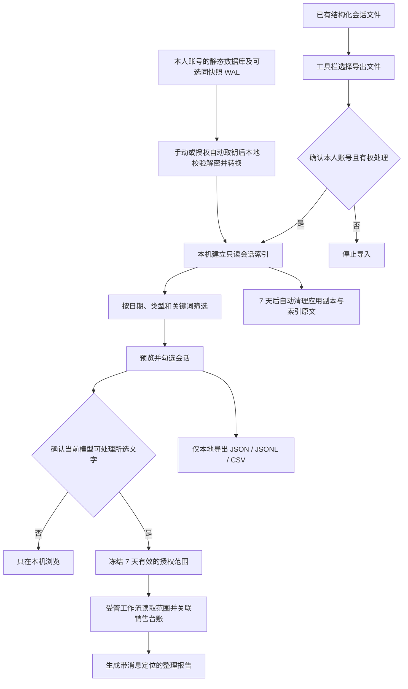

# 微信会话导入与整理

## 功能定位

销售总监版可把本人有权处理的微信会话导入本机，按联系人、群聊、日期和关键词筛选，再交给当前选择的模型整理销售进展、承诺、异议、风险与下一步。

这不是后台监控或微信插件。当前版本：

- 默认不访问微信进程。自动取数据库密钥必须另行明确授权、列出并选择当前用户的 64 位微信进程，且仅在本次导入时只读访问。
- 不扫描微信安装目录或任意本地目录。
- 不修改微信数据库，不发送消息，不自动更新销售台账。
- 不接入 WeFlow。
- 接受用户在“工具栏 → 微信会话整理”中主动选择的 JSON、JSONL 或 CSV 文件。
- 内嵌 WXDecipher 面板：主动选择数据库静态副本，手动提供或一次性自动匹配密钥，校验解密后转换为结构化会话；可加入同快照、同名 WAL 恢复已提交的新消息。
- 独立媒体面板：选择媒体文件副本，本地恢复、图片预览和下载；不扫描目录、不联网补下载、不自动关联会话。
- 本地浏览和 JSON、JSONL、CSV 导出不调用模型；智能整理仍需单独选范围并授权。

按 [WXDecipher 设计文档](https://github.com/JiaoTangXQ/WXDecipher/tree/main/docs/dev) 实现了本地导入链：密钥验证、逐页解密、微信 4.x 消息解析、联系人映射、文本预览和结构化导出，并增加 Windows/macOS 实验性自动取钥、媒体副本恢复和离线 WAL 重放。上游公开仓库仍是设计规范，本模块是工作台内的独立 Python 实现，不是上游已发布软件的嵌套窗口。沿用其只读原库、工具自有副本、统一消息模型和来源定位设计，许可证见 [WXDecipher-LICENSE.txt](third-party/WXDecipher-LICENSE.txt)。

不实现持续监听、关闭 SIP、重签名微信、提权、图片密钥自动提取、SILK 转码、数据库语音 BLOB 导出、媒体与消息自动关联、MCP 服务和持久化密钥库。不同微信版本的真实兼容性需要额外验证，不能把 SQLCipher 格式或合成进程测试通过等同于所有微信版本兼容。

## 运行与隐私前置条件

当前微信 HTTP 入口在 Windows 64 位和 macOS 64 位后端开放。Windows 使用系统 TCP 表与进程令牌校验同一用户和登录会话；macOS 使用系统 `lsof`/libproc 视图核对当前 TCP 连接的客户端 PID、UID 与创建时间，并在处理前后复验连接。身份无法确认时返回 `LOCAL_USER_REQUIRED`，不会仅凭 `localhost` 地址信任请求；健康检查仅返回最小状态。令牌、来源限制及功能授权仍需另外通过。这不能隔离当前用户运行的恶意程序，也不能抵御管理员或系统级攻击者。

安装目录必须可信，其他普通用户不能修改后端代码或页面脚本。微信数据所在卷须支持访问控制；新建的 `data/wechat/`、暂存及导入批次目录使用私有权限（Windows 下仅当前用户与 SYSTEM，关闭外来权限继承），文件也会复验权限、链接及所属身份。祖先目录存在其他用户可替换目录、删除子项或更改权限的授权时，即使最终子目录 ACL 看似私有，也会拒绝处理。不要在共享可写的工程目录或 FAT/exFAT 卷中使用真实微信数据。

已有微信目录只检查、不自动更改权限或迁移内容。不符合条件时显示 `UNSAFE_PATH` 并停止导入；应先由用户或管理员确认安全的安装位置及旧数据处理方案。应用不会为修复该错误修改整个项目、系统临时目录或盘符根目录权限。所有操作应使用普通用户身份，不应通过“以管理员运行”绕过错误。

数据库导入遇到该错误时，工作台会提供目录设置弹窗，也可主动点击面板中的“申请专用数据目录”。弹窗中的完整路径可编辑：默认是当前用户主目录的 `Agent4Market-PrivateData/<项目标识>/wechat/`，也可粘贴自选本机专用目录，例如 `C:\Users\你的用户名\WechatWorkspace`。上级文件夹须已存在，目标目录须为空或尚未创建，并通过私有权限及祖先路径检查；不支持盘符根目录、网络目录或链接路径。填写后点击“检查并继续”，核对最终路径，再点击“允许创建”。取消任一步均不切换或创建目录。仅修改输入框并不会改变后续导入位置。

授权配置保存在默认用户私有目录中，数据库暂存、结构化导入副本和聊天索引统一使用确认后的自选位置，重启后继续有效，旧版默认目录配置继续兼容。创建成功后需重新点击导入，手动密钥和一次性取钥授权需要重新填写或确认，不自动重试敏感操作。已启用目录若有数据或未完成的导入，拒绝切换，不自动迁移、覆盖或删除旧数据。

复制与解析分为两个按钮。用户选定数据库后点击“1. 复制数据库”，把数据库及配对 WAL 复制到 `<专用数据目录>/decipher/<本次会话>/`；直接选择文件则上传到同一位置。复制不需要密钥，也不读取微信进程。整批复制与文件校验通过后封存，再点击“2. 解析已复制数据库”，才对该目录中的副本执行 WAL 重放、解密和解析。解析及失败重试均不再访问原文件。

封存的输入 DB/WAL 副本保留至会话创建后 30 分钟，解析成功或失败都不延长时间；每次解析产生的解密明文、合并库和转换暂存立即清除，一次性取钥授权不复用。清理受文件占用等原因阻碍时，提示清理未完成，继续尝试其他文件并暂停再次解析，下次访问重试清理；不会把已经成功导入的数据误报为未导入。“清除副本／重新选择”只清除当前批次的复制副本，不删除微信原库或已经导入的索引；要更新数据库，清除后重新检索并复制。

当前页面只在内存保存批次句柄，刷新或关闭页面后不提供恢复入口；遗留副本仍按 30 分钟期限在下次启动或访问时清理，未运行时没有后台清理服务。最多同时保留两批，刷新前建议主动清除副本。转换后的结构化副本保存在 `imports/`，索引为 `chat-index.sqlite3`，其中原文仍固定保留 7 天。这不是长期数据库备份功能。

该授权不申请管理员权限、不改变微信原目录或父目录的 ACL，也不免除安装目录可信的前置条件。原 `data/wechat/` 非空时拒绝切换，避免隐藏已有会话；需先另行确认旧数据处理方案。新位置或其祖先路径仍不安全时继续拒绝，不降低安全检查。工作台移动到其他路径会被识别为另一个项目，不自动寻找或迁移之前的数据。

启动入口也属于信任边界。安装器当前主路径是 Tauri 桌面程序，但正式 WebView2 包仍需单独验收。仓库保留的 `launcher/Agent4MarketLauncher.cs` / `scripts/build-windows-launcher.ps1` 不在本轮通过范围：旧 C# 启动器仅凭可伪造的 `DirectorWorkbench/` 响应头判断已有服务，可能打开其他进程预占端口提供的页面；在补充不可伪造的服务身份校验前，不要使用该入口处理真实微信文件。本轮没有改造或发布该旧启动器。

## 使用流程



### 0. 从数据库副本开始（内嵌 WXDecipher）

先满足上述运行条件，安装依赖后重新启动工作台后端：

```powershell
python -m pip install -r requirements-wxdecipher.txt
```

常规 `requirements.txt` 也已包含这三项依赖：`pycryptodome==3.23.0`、`zstandard==0.25.0` 和 `Pillow==12.3.0`。不需要启动第三方服务、安装 SQLCipher CLI 或注入微信插件。

1. 打开“工具栏 → 微信会话整理”，展开 WXDecipher 面板。
2. 填写数据库使用的本人微信 ID（必填，不是昵称），作为稳定账号标识并识别“本人发送”；可另填账号展示标记。不同账号必须填写不同 ID，改展示标记不会重复建立会话。离线消息库并不总含可验证的所属账号字段，本模块不能证明该 ID 的归属，也无法完全识别用户混选的账号；请按确认声明准确填写并只选同一账号副本。
3. 勾选本人账号且有权处理，以及同一账号完整静态数据库副本的确认。自动检索直接复制常见数据目录中的文件，因此应先退出微信，避免复制期间数据库或 WAL 继续变化。
4. 按当前平台选择数据库来源：
   - `Windows 自动检索` / `macOS 自动检索`：仅在点击后遍历对应平台的常见微信数据目录，只读取兼容文件的名称、大小和修改时间；不会打开数据库内容。结果按账号目录分组且 10 分钟有效，必须由用户选择一个账号目录后才加入本批次。复制前后会校验文件身份、大小和修改时间，变化时整批停止并清理暂存。
   - `手动指定聊天记录位置`：粘贴当前系统下的微信账号文件夹完整路径，点击 `检索此目录`（也可回车）。工作台仅在此目录及其子目录内查找消息库、联系人库和配对 WAL，不需要逐层找到数据库文件；支持 Windows 盘符路径、macOS 绝对路径和 `~/` 路径。目录不存在、无访问权限或未找到兼容数据库时会显示提示。
   - `直接选择数据库文件`：打开系统文件选择窗口，由用户选择 `.db`、`.sqlite`、`.sqlite3` 及配对 `-wal` 文件；未支持目录检索的平台也保留此入口。
   消息分片通常为 `message_*.db`；可同时加入 `contact.db`、会话库和含 `SenderName2Id` 的资源库以补全名称映射。不要混合账号。需要恢复 WAL 时，同时选择对应的 `message_0.db-wal` 等同名文件，并勾选 WAL 重放确认。
5. 点击“1. 复制数据库”，核对副本位置，等待“复制完成，尚未解析”。此步骤不需要密钥；复制后文件列表与账号绑定本批次，不能追加或替换。
6. 输入 64 位十六进制密钥（32 字节），也可逐库填写密钥覆盖公共密钥；明文 SQLite 留空。若需自动取钥，单独授权并选择进程。选择密钥模式后点击“2. 解析已复制数据库”。仅处理已复制批次，不重新复制源库。
7. 若有 WAL，先在新应用副本中重放；所有最终加密页通过认证、所有数据库通过 SQLite 完整性检查后，再解析并一次性导入。失败后可更正密钥或重新授权取钥，直接重试同一批副本。若要更换数据库，先点击“清除副本／重新选择”，再重新检索和复制。

支持的加密参数固定为 4096 字节页、AES-256-CBC、SHA-512 HMAC、80 字节保留区；派生模式使用 PBKDF2-HMAC-SHA512、256000 次迭代。不自动尝试任意密码、其他加密页大小、旧版 SHA-1 格式或明文页头/外置盐布局。

消息解析识别具备微信 4.x 核心字段的 `Msg_<32位MD5>` 表，以 `sort_seq`、`local_id` 保持原始顺序；通过 `Name2Id` / `SenderName2Id` 映射发送者。支持 UTF-8 和 Zstandard 文本、常见 XML 卡片摘要；会话内图片、语音、视频仍显示占位，媒体副本在独立面板恢复，不解析附件路径、不访问网络。未知映射会返回警告和可追溯标识，不伪造联系人姓名。

安全限制：一次最多 16 个主库及其 16 个 WAL，单文件 256 MiB，总计 1 GiB；重放后的单库也不得超过 256 MiB。最多转换 20 万条消息、64 MiB JSONL。SQLite 排序临时数据强制放在内存，避免明文落入系统临时目录；大表排序可能占用较多内存，因此不建议在低内存机器一次处理上限大小。单次任务串行处理数据库；同一后端进程内的并发提交返回忙碌状态，不支持多个后端同时操作同一数据目录。

必须由用户提供一致的静态副本：已完成 checkpoint 的主库，或同一时点取得的主库和 WAL。单独复制正在写入的主库可能缺消息；工作台不能判断用户未选择的 WAL 是否存在，也不能证明两个文件是在同一时点原子复制的。工作台不会对原库做 checkpoint。联系人和发送者映射库应尽量一次加入：后补映射不会重复生成已有消息，但也不会自动回填已有消息的发送者信息。

### 0.1 Windows / macOS 自动取数据库密钥（实验性）

1. 用普通系统用户运行工作台，保持本人微信登录；Windows 不要以管理员身份运行工作台。
2. 选择本人账号的静态数据库副本，勾选“允许本次自动取数据库密钥”。
3. 点击“列出可选微信进程”，Windows 手动选择 `Weixin.exe`，macOS 手动选择带版本和架构标记的“微信”主进程。列出进程只读取身份和版本元数据，默认不会选中任何进程；启动页面或手动密钥导入不会列出进程。
4. 整批复制完成后，点击解析才签发与本批文件指纹、PID 和创建时间绑定的 60 秒一次性取钥授权票据；消费票据后才只读扫描所选进程，缺失、过期、输入改变或重放均拒绝。进程必须属于当前系统用户，并匹配选择时的 PID、创建时间与可执行文件身份；Windows 还校验登录会话。进程退出、PID 重用、权限不足或版本不支持时停止，不提权重试。解析重试必须重新确认取钥，复制阶段不访问进程。
5. 候选密钥先用所选上传副本的首页 HMAC 验证，再对最终数据库逐页认证；原始密钥不显示、不返回浏览器、不写入配置或日志。每次请求结束会清除界面的取钥确认与进程选择，重试需重新确认。

Windows 支持原生 x64 `Weixin.exe`，不支持旧版 `WeChat.exe`、32 位或 ARM64；使用 `PROCESS_QUERY_INFORMATION | PROCESS_VM_READ`。macOS 支持 64 位 `com.tencent.xinWeChat` 主进程，通过 libproc 复核同用户、路径、PID、启动时间、版本和构建号，通过 `task_for_pid` / `mach_vm_read_overwrite` 只读访问。微信 4.1.x 进入 `wechat-macos-4.1` 适配档，其他 4.x 仅使用通用实验性扫描。微信启用 Hardened Runtime 时，SIP 开启的常规系统通常会拒绝 `task_for_pid`；工作台会明确报错，不关闭 SIP、不重签名微信、不提权。两端均无注入、无暂停、无内存转储文件；每次扫描最多 30 秒、1 GiB 累计读取和 4096 个候选。

识别完整的 SQLCipher 原始密钥字面量，以及公开实现中观察到的 `Config.Cipher` x64 布局；对指针范围、长度和重复读取的一致性做校验，不会任意试探未知偏移。该布局没有真实微信版本的验证清单，可能找不到密钥；未找到全部所需密钥时整批不导入，可改用手动密钥。进程账号与数据库盐/HMAC 不匹配也会失败，不能据此直接判定微信故障。

### 0.2 WAL 离线重放

仅接受同一批次同名配对，如 `message_0.db` + `message_0.db-wal`；不需要、也不接收 `-shm` 或回滚日志。按 SQLite WAL 头部、页大小、世代盐和累计校验和检查连续有效前缀，取至最后一个有效提交；重复页取提交范围内最新版本，并按提交页数处理收缩和增长。

遇到不完整、旧世代或校验失败的尾帧，在首个无效点停止，不跳过坏帧继续；未提交尾部不导入，结果显示警告及恢复页数。空 WAL 或没有提交时只使用主库；损坏头部、无法补齐的增长页、加密首页盐不匹配或最终页认证/完整性失败则拒绝本批次。极少数依赖 auto-vacuum 隐式全零新页的合法 WAL 可能被保守拒绝，应重新提供完成 checkpoint 的静态副本。

WAL 普通校验和不是密码学认证；即使 SQLCipher 页 HMAC 与 SQLite 完整性检查均通过，也不能证明 DB/WAL 是同一时点的配对快照。不要混用不同备份时间的同账号文件。所有重放仅发生在新应用副本中，原 DB/WAL 不变；每份 WAL 的帧扫描限时 60 秒。

### 0.3 媒体副本恢复

在同一页面展开“媒体副本恢复”，勾选上方本人账号授权后选择 1–4 个媒体文件，单个不超过 16 MiB。文件选择即开始本地恢复，不要求先导入数据库。

| 输入 | 当前处理范围 |
|---|---|
| 旧版单字节 XOR DAT | 根据已知图片文件头反推 XOR，并完整解码校验 JPEG、PNG、GIF、WebP、BMP |
| V2 分段 DAT | 手动提供独立图片 AES 密钥，恢复 AES 前段、原样中段及 XOR 尾段；不是数据库密钥 |
| 普通图片 | 完整解码校验后预览、下载，限制单帧 1600 万像素、最多 200 帧、总计 6400 万帧像素 |
| 已落盘 MP4 / WAV | MP4 仅校验顶层容器，WAV 校验 PCM 数据长度；提供下载，不自动播放 |
| 已落盘 SILK | 仅识别文件签名并提供原始文件下载，不验证音频帧、不转码、不直接播放 |

V2 图片密钥须为 16 个非空格可打印 ASCII 字符或 32 位十六进制。XOR 参数为十进制 0–255；留空时仅尝试通过 JPEG/PNG 的完整尾标记反推，不使用猜测的默认值。V1、WXGF/HEVC 等未知容器明确拒绝。DAT 没有认证码，图片解码成功不证明内容未被篡改。

媒体不写入后端文件或会话索引；二进制结果只保留在当前页面，点击下载才交由用户保管。清除预览、开始下一批或关闭页面会释放页面持有的结果；已下载文件不受 7 天清理管理。单批部分文件失败会逐项说明，不影响其余文件。不从语音数据库提取 BLOB、不自动寻找缺失附件或提取图片 AES 密钥，不把任何媒体交给模型。

### 1. 准备结构化导出

文件扩展名必须为 `.json`、`.jsonl` 或 `.csv`，单个文件不超过 64 兆字节。每条消息至少要能识别以下信息：

| 信息 | 推荐字段 | 可识别别名示例 |
|---|---|---|
| 稳定账号标识 | `account_id` | 导出时保留；手工填写本人 ID 与文件中 ID 冲突时拒绝导入 |
| 账号展示标记 | `account_label` | 不作为已绑定账号的唯一身份 |
| 会话标识 | `conversation` | `conversation_id`、`talker`、`username`、`chat_id`、`room_id` |
| 会话名称 | `conversation_name` | `display_name`、`talker_name`、`chat_name`、`room_name` |
| 消息标识 | `message_id` | `msg_id`、`local_id`、`id` |
| 发送者 | `sender_name` | `sender`、`from_name`、`author` |
| 是否本人发送 | `is_self` | `is_sender`、`from_me`、`mine` |
| 时间 | `time` | `epoch`、`timestamp`、`create_time`、`sent_at`、`date` |
| 类型 | `kind` | `type_label`、`message_type`、`msg_type` |
| 正文 | `content` | `body`、`text`、`message` |

JSON 可以是消息数组，也可以包含 `messages`、`rows`、`data`、`items` 或 `conversations`。群聊可设置 `is_group: true`，或使用以 `@chatroom` 结尾的会话标识。

示例：

```json
{
  "conversations": [
    {
      "username": "client-a",
      "display_name": "客户甲",
      "messages": [
        {
          "local_id": "1001",
          "sender_name": "客户甲",
          "is_self": false,
          "time": "2026-08-25T09:30:00+08:00",
          "type_label": "文本",
          "content": "下周二需要初版技术方案。"
        }
      ]
    }
  ]
}
```

### 2. 本机导入和筛选

1. 打开“工具栏 → 微信会话整理”。
2. 可填写“微信账号标记”，用于区分不同来源；它不是微信登录账号。
3. 勾选“本人账号且有权处理”，再选择导出文件。
4. 选择日期、会话类型和可选关键词。
5. 点击一个会话可在右侧预览，勾选框决定本次要整理的范围。

WXDecipher 数据库导入按本人微信 ID 隔离和去重，账号标记只用于展示。原有结构化导入未提供本人 ID 时仍按账号标记隔离，因此不同账号必须使用不同标记；跨文件遇到相同稳定消息标识也会跳过重复消息。

### 2.1 仅导出所选会话

勾选会话，设置日期和关键词，再选择 JSON、JSONL 或 CSV 并点击“导出所选”。确认框会冻结当前范围；不会扩大为全部账号，也不会触发智能整理。导出的是筛选范围内消息，不限于当前预览的最近 100 条。

每次最多 50 个会话、5 万条消息、16 MiB。超过上限将明确拒绝，不静默截断。CSV 对公式起始字符做转义；JSON / JSONL 不进行该转义，保留索引文字、稳定消息标识和账号标识，适合再次导入。文件可含多账号，但每条消息均保留所属账号；重新导入时留空本人 ID 可沿用文件中的账号标识，指定本人 ID 则必须全文件匹配。

导出的是统一索引文字，包括卡片摘要、媒体占位和既有导入规范化（Unicode NFKC、首尾空白裁剪），不是原数据库的逐字节备份。下载后的文件由用户管理，不受工作台 7 天清理策略控制。

### 3. 创建智能整理任务

本机预览不会调用模型。只有勾选“允许当前任务使用所选会话文字”并再次确认后，工作台才会：

1. 冻结会话、日期和关键词，生成 `wechat-scope-...` 授权范围编号。
2. 把范围编号写入本次销售总监任务。
3. 由 `director_wechat_read` 读取完全相同的范围；工具不能传入其他会话或日期。
4. 只读关联当前销售台账，帮助识别已有客户；姓名相似但证据不足时保留为“待确认”。
5. 在 `outputs/wechat-reviews/` 生成 Markdown 报告。

每个关键事实和明确承诺都应保留 `wechat://message/<message_id>` 定位。报告不会按消息数量评价销售人员，也不会自动把内容写入客户、活动、承诺或行动表；若要更新台账，需要用户另行发起客户复盘，并经过原有待写入卡片和人工审批。

## 数据保留与模型边界

- 密钥仅在本次请求内存中使用，应用不写入配置、日志或会话文件；界面提交后清空密钥输入。Python/浏览器运行时不保证物理内存立即安全擦除，也不能保证操作系统交换文件或崩溃转储不留下内存内容。
- 数据库/WAL 复制副本位于专用数据目录下的 `decipher/`（未自选时沿用默认位置），固定 30 分钟到期，支持主动清除。每次解析生成的重放、解密和转换输出立即清理；复制副本仍可用于重试。异常中断遗留的暂存在到期后下次启动或访问时清除；应用未运行时不会有后台清理服务。
- JSON / JSONL / CSV 上传同样先确认账号授权，再进入上述私有、可到期清理的暂存区，不将聊天原文写入系统公共临时目录。导入复制或复验失败会移除尚未登记的副本；文件权限变动等导致无法删除时明确返回 `CLEANUP_FAILED`，需要用户处理，不承诺此类异常下已成功清除。
- 自动捕获的数据库密钥不返回接口；媒体 AES 密钥仅在当前本机请求中使用，提交后清空输入。媒体以二进制本机响应返回，不落后端磁盘、不进模型；页面结果与用户下载副本的保留策略不同。
- 导入后的工具副本和索引中的完整消息文字固定保留 7 天，启动应用或点击“清理已到期原文”时自动清理。
- 异常退出遗留、未登记进索引的结构化批次副本也按 7 天到期清理。删除属于应用层清理，不承诺磁盘取证意义上的安全擦除。
- 清理不会触碰用户选择的原始导出文件，也不会删除已经生成的整理报告或已批准的销售台账记录。
- `data/wechat/` 被 Git 忽略，真实聊天内容不得提交到公开仓库。
- 会话列表、筛选和预览只在本机工作台进行。
- Pi 核心在空闲、运行和完成状态均禁止通用 shell 与敏感目录读取，不能通过普通对话读取解密暂存；会话原文仍须经过范围与模型接收方绑定的适配器。
- 如果本次选择的是云端模型，创建整理任务后，所选范围内的文字会发送给该模型服务商；请依据公司制度、客户约定和适用法律决定是否使用。
- 单次最多 50 个会话、600 条消息，正文合计还有独立字节上限。超过时请缩短日期、增加关键词或减少会话。

## 平台支持与验证边界

数据库解密、WAL 重放、媒体恢复和结构化索引的算法模块使用 Python 和上述三个依赖，不依赖上游未发布的程序。面向页面的微信 HTTP 接口支持 Windows 64 位和 macOS 64 位；Linux 仍因缺少已验证的本机客户端身份隔离而禁用。macOS 支持用户主动选择数据库副本、手动提供密钥、WAL 重放、媒体恢复、结构化导入和授权整理；同时可列出并识别微信 4.1.x 主进程，只有 macOS 实际授予 `task_for_pid` 时才进入内存扫描。

验证使用合成微信 4.x 表结构、SQLCipher 密文样本、真实 SQLite 生成的合成 WAL、合成媒体、HTTP 合约与前端交互测试。Windows 原生读取测试只访问测试自行启动的 Python 子进程；macOS 连接测试只访问测试自行创建的回环 TCP 连接。未读取真实微信账号、数据库或进程，尚不能声明所有微信版本均已完成兼容性验证。旧版微信表结构会明确拒绝，在满足运行条件后可继续使用 JSON / JSONL / CSV 入口。

## 实现与验证

数据库链：`ui/app.js` → `local_http_security.py` 同用户/会话验证及令牌保护 → `wxdecipher.py` 私有上传会话与一次性授权 → 可选 `wxdecipher_capture.py` 取钥 → 可选 `wxdecipher_wal.py` 新副本重放 → `wxdecipher_crypto.py` 校验解密 → `wxdecipher_reader.py` 格式适配 → `wechat_store.py` 原子索引导入。`wechat_privacy.py` 统一保护微信文件与目录；媒体走独立 `wxdecipher_media.py`，二进制响应回当前页面，不进入数据库链。模型仅通过原有 `director_wechat_read` 读取另行授权的范围，不能读取进程、密钥、媒体或解密暂存。未修改原库，没有引入后台服务、全盘扫描或外部上传接口。

验证命令（项目根目录）：

```powershell
python -m pytest tests ui/test_server.py plugin/market-director-copilot/tests -q
node --test tests/ui-wxdecipher.test.mjs tests/vertical-workflow-selection.test.ts
node node_modules/typescript/bin/tsc --noEmit
python -m agent_platform validate
```

2026-09-09 的验收环境为 Windows x64、Python 3.11.9、Node 24.19.0：上述完整 Python 范围通过 397 项测试及 126 个子测试，8 项 POSIX 专用用例在 Windows 跳过；UI、模型边界、运行时和数据适配器等相关 Node 回归共 99 项通过。TypeScript、Python/JavaScript 语法检查、工作流配置校验均通过。隔离 Edge 端到端覆盖手动解密、一次性合成进程取钥、WAL 重放、媒体下载、零模型调用和暂存清理；未启动或重启实际桌面应用。

独立密码学交叉验证使用 [SQLCipher v4.0.1 官方测试](https://github.com/sqlcipher/sqlcipher/blob/v4.0.1/test/sqlcipher-compatibility.test#L103-L112) 对应的公开样本 `sqlcipher-4.0-testkey.db`。样本为 978944 字节、239 页，固定 Git blob SHA-1 为 `b8db5378cbc5b015f857e4c4a9a66f522d8f832b`；验证逐页 HMAC、`integrity_check=ok`、`t1` 的 78536 行，以及输入文件不变。样本不随产品分发，测试不会联网下载；设置 `WXDECIPHER_SQLCIPHER4_FIXTURE` 为本地样本路径后运行 `tests/test_wxdecipher_sqlcipher_oracle.py`，否则该用例明确跳过。

浏览器回归脚本为 `tests/ui-wxdecipher-browser.mjs`，需要可用的 Playwright 和浏览器。可选环境变量 `WXDECIPHER_PLAYWRIGHT_MODULE` 指定模块地址、`WXDECIPHER_BROWSER_CHANNEL=msedge` 使用本机 Edge。执行 `npm run test:ui-wxdecipher-browser` 后，在临时目录启动隔离后端，使用合成数据验证错钥、重试、发送者/账号展示、预览、下载、明确进程选择与取钥确认重置、WAL 新消息、V2 图片恢复下载、零模型请求、暂存清理及窄屏布局；不使用真实账号或运行中的桌面应用。截图和合成导出放入被 Git 忽略的 `outputs/verification/`。

扩展回归在 `tests/test_wxdecipher_extensions.py`：覆盖真实 SQLite WAL 对照、大小端校验、重复提交、收缩增长、防旧页复活、无提交/损坏尾部、合成加密 WAL；覆盖图片错钥、分段越界、完整填充块、像素限制、二进制短读及处理锁；覆盖同用户/会话、权限拒绝、PID 重用、结构指针异常、读取预算、原生 Windows 子进程读取。上限大小、长时间运行、多个后端实例及真实微信布局仍需额外验证。

`tests/test_local_http_security.py` 与 `tests/test_wechat_privacy.py` 覆盖原生 TCP 身份与目录权限、表结构边界、不同用户/会话、连接或 PID 重用、祖先替换权限、宽 ACL、非本人 owner、符号链接及失败清理。微信集成测试在用户目录下创建独立临时根目录，避免将系统临时目录误当作私有数据区；不会修改项目或系统目录的 ACL。

格式与 API 依据包括 [SQLite WAL 文件格式](https://www.sqlite.org/fileformat2.html#walformat)、[Microsoft ReadProcessMemory](https://learn.microsoft.com/en-us/windows/win32/api/memoryapi/nf-memoryapi-readprocessmemory)，以及公开实现中观察到的 [WCDB Config.Cipher 布局](https://github.com/fanyuantaier/wechatauto-replica/blob/main/wechatauto/db.py) 和 [DAT 图片分段格式](https://github.com/fanyuantaier/wechatauto-replica/blob/main/wechatauto/media.py)。后两项是兼容性观察，不是腾讯官方稳定协议，也不构成全版本支持保证。

补充回归覆盖了跨账号同名标签、账号重命名、无服务器消息 ID、补充映射、跨库不同密钥、损坏页、部分上传、崩溃孤儿恢复、CSV 公式转义、大小限制、XML/Zstandard 异常及空闲/运行/完成三种 Pi 状态下的隐私边界。旧版索引采用附加账号绑定表，保留既有消息 ID 和授权范围；不自动把历史未绑定账号的记录迁移到新账号命名空间。

## 故障处理

- `UNSAFE_PATH`：检查安装位置、微信数据及祖先目录的所有者和访问权限；先确认安全迁移/权限处理方案，不能只修改最后一层目录，更不能通过管理员运行规避。
- `LOCAL_USER_REQUIRED`：用与后端相同的 Windows 用户及登录会话打开页面；本机进程身份无法核验时会拒绝，不回退到仅令牌认证。
- `LOCAL_ISOLATION_UNSUPPORTED`：当前平台的微信 HTTP 入口尚未开放；不是密钥错误。
- `CAPTURE_CONSENT_REQUIRED`：取钥票据已过期、已使用或输入变化；重新选文件、确认取钥并选择进程后再提交。
- `CLEANUP_FAILED`：本批应用副本清理失败；检查私有目录状态并处理应用副本后重试，不应删除用户选择的原始文件。
- “缺少本地解密依赖”：安装 `requirements-wxdecipher.txt`，并重启工作台后端；压缩消息还需要 `zstandard`。
- “首页校验失败”：确认账号、密钥、逐库密钥和所选模式；不会保留失败库供后台反复尝试。
- “第 N 页校验失败/完整性校验失败”：重新准备同一时刻的完整静态副本；不要跳过坏页或直接导入部分记录。
- “没有可选进程/自动取钥不可用”：Windows 确认使用原生 x64 `Weixin.exe`、普通用户工作台和同一登录会话；macOS 确认使用官方 64 位微信主应用。若已发现 macOS 进程但 `task_for_pid` 被 Hardened Runtime/SIP 拒绝，当前版本只能改用手动密钥。
- “只找到部分匹配密钥/扫描达到上限”：检查是否混选账号、选错进程或使用不支持的布局。重试须重新授权；手动填写已知密钥可以缩小自动匹配范围。
- “WAL 不匹配/缺少必要页”：重新取得同一时点的配对静态副本，或改用已经完成 checkpoint 的主库。不可删除原 WAL 来规避校验。
- “图片密钥或 XOR 不匹配”：图片 AES 密钥不同于数据库密钥；确认 V2 版本与 XOR 参数。未知 DAT/WXGF 容器暂不支持，不会通过修改扩展名强行播放。
- “未识别到微信 4.x 消息表”：确认选择了消息分片而不只是联系人库；未知结构需补充适配并验证。
- “没有识别到消息”：检查是否包含会话标识、时间和正文列，CSV 第一行必须是字段名。
- “范围过大”：缩短日期、输入客户或项目关键词，或减少勾选会话。
- “范围已到期/消息已清理”：重新导入原始结构化文件并重新选择范围。
- “索引版本不受支持”：保留 `data/wechat/` 现场并升级应用，不要手工改库。
- 不确定是否有权处理某段聊天时，不要导入；先取得相关人员或组织授权。
