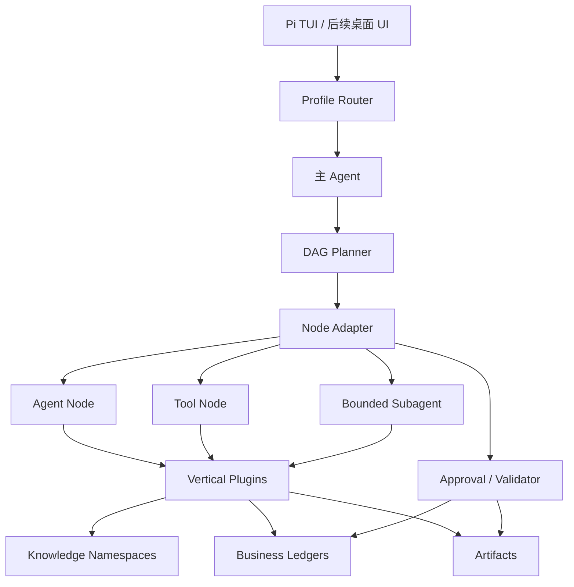
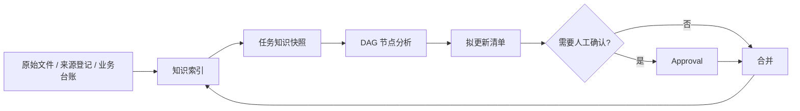

# 轻本体插件架构

## 1. 目标与范围

目标是让非技术用户打开后直接选择“市场总监”或“产品总监”的服务，同时让开发者可以单独增加、替换和升级领域能力。

第一阶段必须实现：

- Pi 作为会话、模型与 Skill 运行时。
- 轻本体负责插件发现、依赖解析、权限校验、Profile 组合和 DAG 规划。
- 市场总监和产品总监两个开箱即用 Profile。
- Agent、Tool、Subagent、Approval、Parallel、Join、Validator 七类流程节点。
- 现有知识库入口与事实分级规则。
- 新 Agent 不接入微信或 WeFlow。

第一阶段不做独立桌面客户端、云端多租户、自动对外发送、生产级分布式队列和无人工确认的关键业务写入。

## 2. 总体结构

### Pi 层

Pi 提供模型调用、会话、命令、扩展和 Skills。`package.json` 是安装入口，`pi/extensions/vertical-workflow.ts` 提供岗位切换、按 Profile 动态加载 Skills、服务列表和服务启动命令。当前实现基于 Pi 0.84.2 API。

### 轻本体

轻本体不包含市场或产品规则，只提供：

- 插件 manifest 加载与版本依赖解析。
- Profile 组合及服务路由表。
- 节点权限与 Subagent 边界校验。
- DAG 无环校验和确定性执行计划。
- 未来任务状态、检查点、强制审批、工具适配、迁移与回滚的稳定接口位置。

### 插件与 Profile

插件拥有领域 Skill、DAG 工作流、权限声明和依赖。`shared` 插件可被多个岗位复用；`market` 和 `product` 插件承载领域规则。Profile 是面向用户的开箱组合，只暴露服务名称，不让真实用户逐个选择底层插件。

## 3. 主 Agent、DAG 与 Subagent

三者不是替代关系：

1. 主 Agent 识别意图、选择服务、补齐会改变方向的关键信息。
2. DAG 固定高价值流程的顺序、并行关系、审批点、写入点和输出门槛。
3. Subagent 只处理可以独立验收的研究分支、只读扫描或独立复核。

Subagent 节点必须声明目标、允许工具、最大轮次和写入范围。首版只允许只读 Subagent，非空写入范围会被校验器拒绝。数据库写入、正式文档生成、对外发送、客户阶段变更和发布决定不能交给无边界 Subagent 自由处理。

当前 Pi 扩展会把 DAG 计划交给模型，并要求在 Approval 处暂停，但尚未维护持久任务状态，也未拦截任意 Pi 工具调用。因此 Approval 目前是可审计的流程策略，不是安全强制边界；需要无人值守执行前，必须补充任务状态机、逻辑工具适配器和 `tool_call` 强制门禁。

## 4. 插件契约

| 字段 | 作用 |
|---|---|
| `api_version` | 轻本体接口版本 |
| `id` / `version` | 唯一身份与语义版本 |
| `category` | `shared`、`market` 或 `product` |
| `permissions` | 插件可申请的最小权限集合 |
| `dependencies` | 依赖插件及版本约束 |
| `skills` | 供 Pi 按需加载的能力 |
| `workflows` | 插件提供的 DAG 文件 |

Workflow 节点请求的权限必须是插件权限的子集。Profile 服务只能引用其最终依赖闭包中确实存在的 Workflow 与 Skill。

## 5. 知识库关联

`shared.knowledge` 是所有 Profile 的共同依赖，采用“原件不动、索引关联、证据可追溯”的方式接入当前知识库。

知识记录至少保留稳定 ID、对象、陈述、状态、来源、证据位置、发生/发布日期、地域、有效期和访问范围。状态统一为“已证实事实、分析判断、待验证假设、未知信息”。冲突记录并列保存，以时间、地域、口径和来源解释差异。模型摘要不能自动升级为事实。涉及客户阶段、人员评价、正式产品决策或对外承诺的更新必须通过人工关口。

## 6. Profile 组合

市场总监复用研究、知识库、文件和周报，叠加政府合作与销售推进；输入来自用户上传、现有知识库和结构化销售台账，不包含聊天采集入口。

产品总监复用同一轻本体与共享插件，叠加产品发现、需求/PRD、指标与实验、路线图、发布评审。新增岗位不需要复制主 Agent、知识库或文档基础设施。

## 7. 升级与回滚原则

- 轻本体 API 与插件版本分别演进；插件通过语义版本声明兼容范围。
- 新插件先通过契约和 DAG 校验，再加入 Profile。
- 破坏性数据变更必须提供显式迁移、备份和回滚路径；首版不自动执行迁移。
- Profile 升级保留上一版本组合，失败时回退组合而不是删除用户数据。
- [DeepSeek Harness](https://github.com/deepseek-ai/deepseek-harness) 的“Everything is a Plugin”用于设计借鉴，不作为首版强运行时依赖，避免受开发预览阶段兼容变更影响。

## 8. 验收标准

- 两个 Profile 均能解析出完整、无循环的插件依赖。
- 所有 Workflow 都是无环图，节点引用完整。
- 节点不能申请插件未声明的权限。
- Subagent 缺少边界时校验失败。
- 新 Profile 和解析后的插件内容不含微信、WeChat 或 WeFlow 引用。
- 产品总监具备发现、PRD、指标、路线图、发布和周报服务。
- Pi 能切换岗位、列出服务并用对应 Skill 启动任务。
