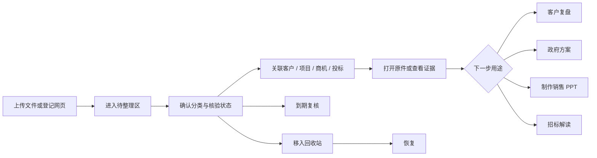

# 销售总监资料库

## 1. 目标与边界

资料库面向销售总监个人使用，把分散在来源登记、项目空间、投标项目和输出目录中的资料汇总成一个可检索、可关联、可直接发起任务的工作入口。

必须实现：

- 文件或网页一次登记，后续可按客户、项目、商机、投标、地区、主题和标签检索。
- 原件保持原位；资料库只维护索引、业务关系、核验状态、版本和归档状态。
- 资料卡可直接发起客户复盘、政府合作方案、销售演示文稿和招标解读。
- 所有正式来源写入、销售台账写入和正式文件生成继续经过原有人工确认。
- 归档可恢复，不把“从资料库隐藏”误当成永久删除原件。

首版不做：向量检索、自动 OCR、任意办公文档全文解析、多人权限、云同步、自动外发和永久销毁原件。

## 2. 用户流程

日常操作：

1. 点击“上传资料”选择本机文件，或点击“添加网页”登记来源地址。
2. 新资料默认标为“待核验”，系统根据文件名或主题给出初始分类。
3. 在右侧详情中补充业务关系、地区、主题、发布机构、标签、保密级别和复核日期。
4. 需要继续工作时直接点击资料卡上的任务按钮，不再重复粘贴文件路径和客户背景。
5. 新版文件使用“上传新版本”；旧版本继续保留，资料重新回到待核验状态。
6. 不再使用的资料移入回收站；原件仍保留，可随时恢复。

## 3. 信息架构

固定分类：

- 待整理
- 客户与关键人
- 商机与方案
- 政府与区域政策
- 招投标
- 行业与竞争
- 销售资产
- 公司能力与资质
- 内部资源与负责人
- 回收站

列表支持标题、机构、主题、地区、标签和关键事实搜索，并可按核验状态、项目和客户筛选。顶部统计显示待整理/待核验、已核验、30 天内需复核和近 7 天新增。

## 4. 数据与兼容设计

资料库是统一视图，不是新的业务事实主库：

| 数据 | 原始位置 | 资料库处理 |
|---|---|---|
| 公开来源 | CSV `source-register.csv` 或 SQLite `sources/evidence_refs` | 只读合并，元数据覆盖写入目录索引 |
| 项目文件 | `inputs/projects/<project_id>/` | 只读合并，不搬迁 |
| 资料库直传文件 | `inputs/library/<library_id>/versions/<version_id>/` | 保留不可变版本 |
| 生成产物 | `outputs/` | 只读合并，不搬迁 |
| 分类、关系、标签、版本、归档 | `data/library/catalog.json` | 原子写入的侧车索引 |

为兼容既有工作流，内部逻辑工具仍名为 `knowledge.search` 和 `knowledge.write`，SQLite 表仍使用 `sources/evidence_refs`，兼容接口 `/api/knowledge` 继续保留。用户界面和操作说明统一使用“资料库”。

正式客户阶段、金额、负责人和销售活动以销售台账或启用后的 SQLite 业务库为准；资料库只保存与资料有关的上下文和证据关系，不能覆盖业务主数据。

## 5. 状态与安全规则

核验状态包括待核验、已核验、已替代、已拒绝和已归档。网页登记只表示“已发现”，在正文未读取和核验前不得作为正式事实。电子文档证据提取仍需任务级来源登记和人工批准。

安全规则：

- 单文件 1 字节至 32 MiB，只接受界面列出的文档、表格、图片、演示文稿和压缩包后缀。
- 路径必须位于受控 `inputs/` 或 `outputs/`，拒绝路径穿透和符号链接。
- 直接上传文件按 SHA-256 去重；追加完全相同的版本会被拒绝。
- 元数据编辑、归档和恢复使用乐观版本检查，避免覆盖另一窗口的修改。
- 打开直接上传文件前重新核对 SHA-256；内容变化则停止并要求上传新版本。
- 已被任务或业务记录引用的资料归档时进行二次确认；归档不删除原件。

## 6. 验收标准

- 现有来源、项目文件和产物可在资料库中看到，原文件路径和内容不发生变化。
- 上传一份新文件后产生一条待整理记录；上传新版本后可看到完整版本历史，旧版本仍存在。
- 相同网页地址不会产生重复记录；URL fragment 不参与去重。
- 编辑分类和业务关系后刷新页面仍保留；旧版本提交会被拒绝。
- 资料可打开、用于任务、移入回收站并恢复。
- 资料库搜索不会返回同一引用的重复结果。
- 真实 `data/library/catalog.json` 与 `inputs/library/` 不进入 Git。
- 销售、政府合作、招投标、周报和演示文稿原有受管流程全部回归通过。

## 7. 后续迭代

- P1：受控 OCR、Word/Excel/PPTX 正文提取、段落级证据定位、重复内容合并建议。
- P1：一个资料关联多个客户/项目/投标对象，以及可视化关系视图。
- P2：向量检索与混合排序、资料包模板、批量导入和批量复核。
- P2：在明确的数据治理和权限方案后再考虑多人协作或云同步。
